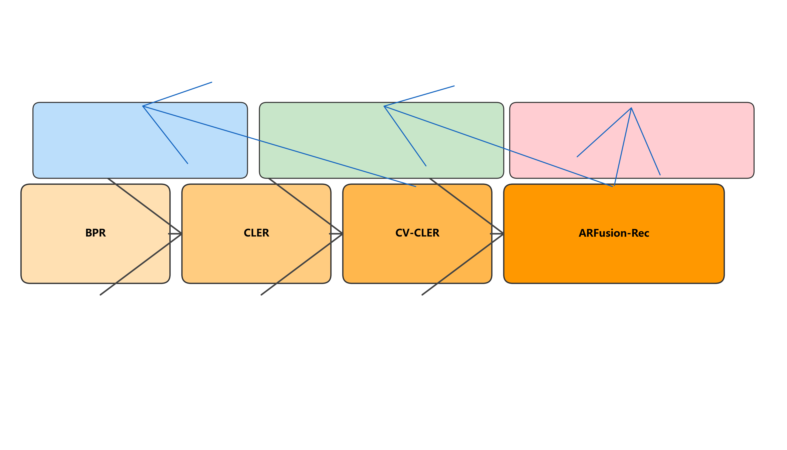
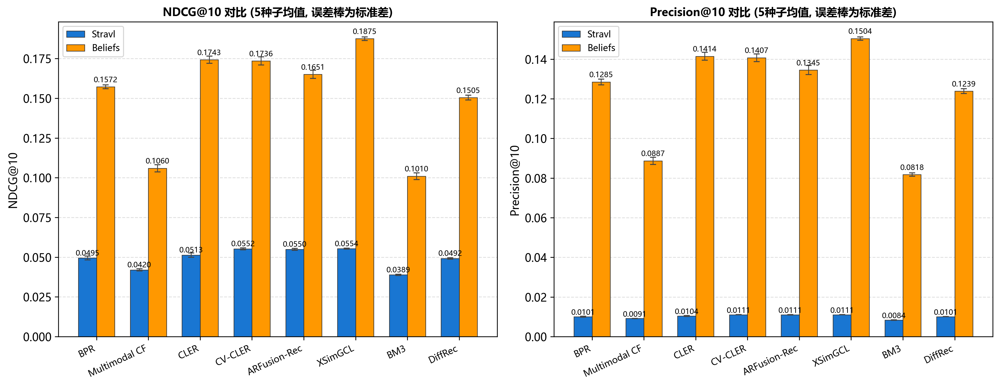
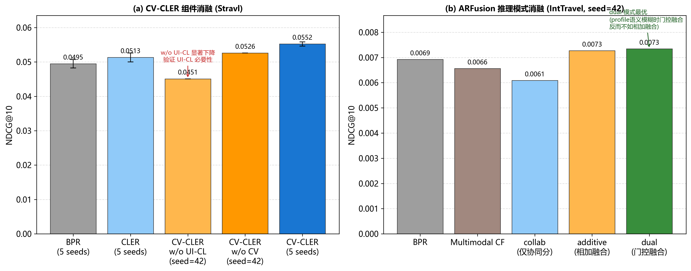
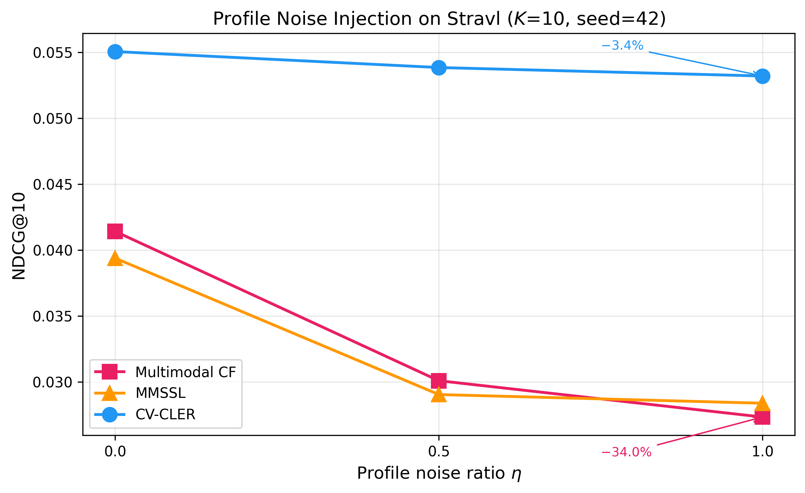
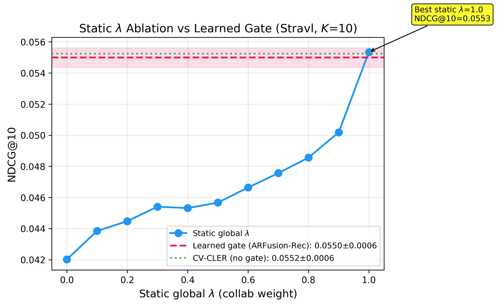
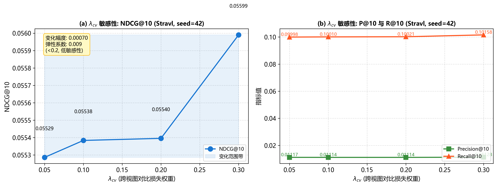
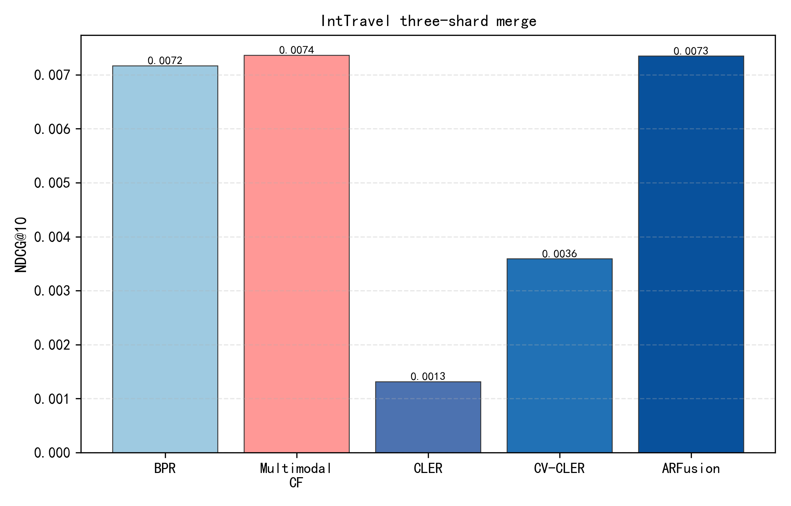

# 面向声明与行为弱相关的跨视图对比推荐方法

曾镜源^1,2^，郭江鸿^1,2^，姜传贤^1,2^，冯亚芬^3,4^+

(1.广东省山区特色资源开发与精准利用重点实验室，广东梅州 514015；2.嘉应学院计算机学院，广东梅州 514015；3.嘉应学院地理科学与旅游学院，广东梅州 514015；4.粤东北山区地表环境与绿色发展重点实验室，广东梅州 514015；)

+通信作者：冯亚芬　E-mail: fyf81@163.com

基金项目：广东省本科高校高等教育教学改革项目（粤教高函〔2024〕9-989）

摘要：针对旅游与内容平台中注册表单与卡片式隐式反馈弱相关、交互长尾并存导致固定早期融合易引入噪声的问题，通过四组公开数据上的对照实验系统验证"评分解耦在弱相关域的一致优势"，并据此归纳按相关性、profile字段语义清晰度与行为密度切换推理路径的经验性选路建议。实现协同对比学习推荐（CLER）、跨视图评分解耦推荐（CV-CLER）与稀疏感知门控融合推荐（ARFusion-Rec）递进框架：训练期跨视图对齐，推理期按profile质量与用户正样本密度在评分解耦与稀疏门控融合间切换。在Stravl等四组公开数据上同协议复现，5种子均值下CV-CLER在Stravl上NDCG@10相对贝叶斯个性化排序（BPR）提升11.6%（经Holm-Bonferroni校正 $p<0.01$），且在所有数据集上一致观察到早期融合（Multimodal CF）劣于纯BPR的现象；在MovieLens-1M与Amazon-Electronics上（单种子seed=42）所提方法相对BPR的NDCG@10提升分别为6.1%与29.8%，对声明特征噪声更稳健；ARFusion-Rec在Stravl上与CV-CLER无显著差异，在IntTravel三分片设定下（匿名profile字段）CV-CLER相对BPR提升30.1%且优于ARFusion-Rec，说明profile字段语义模糊时评分解耦比门控融合更稳健。实验同时表明跨视图对齐（$L_{\mathrm{CV}}$）的增益具有域依赖性，并非普适改进。据此给出面向工程部署的分档选路经验规则。

关键词：推荐系统；跨视图对比学习；评分解耦；稀疏感知门控；多源隐式反馈；POI推荐

文献标志码: A    中图分类号:TP391.3

Cross-View Contrastive Recommendation under Weak Declarative–Behavioral Correlation

ZENG Jingyuan^1,2^, GUO Jianghong^1,2^, JIANG Chuanxian^1,2^, FENG Yafen^3,4^+

(1. Key Laboratory of Characteristic Resource Development and Precision Utilization in Guangdong's Mountainous Regions, Meizhou 514015, China; 2. School of Computer Science, Jiaying University, Meizhou 514015, China; 3. School of Geographic Sciences and Tourism, Jiaying University, Meizhou 514015, China; 4. Key Laboratory of Surface Environment and Green Development in Northeastern Guangdong's Mountainous Regions, Meizhou 514015, China)

+Corresponding author. E-mail: fyf81@163.com

Abstract: Registration profiles and card-style implicit feedback on tourism and content platforms are often weakly correlated and long-tailed, so fixed early fusion easily injects noise. Through controlled experiments on four public datasets, this paper systematically verifies the consistent advantage of score decoupling under weak correlation, and summarizes an empirical inference-path selection rule keyed to correlation strength, profile field semantic clarity, and behavior density. A progressive framework is implemented comprising collaborative contrastive learning for recommendation (CLER), cross-view score-decoupled recommendation (CV-CLER), and sparsity-aware gated fusion recommendation (ARFusion-Rec): views are aligned in training, while inference switches between score decoupling and sparse gated fusion according to profile quality and the density of positive interactions. Under a shared protocol on four public datasets including Stravl, the 5-seed mean NDCG@10 of CV-CLER improves over Bayesian Personalized Ranking (BPR) by 11.6% on Stravl (Holm-corrected $p<0.01$), and early fusion (Multimodal CF) is consistently observed to underperform pure BPR across all datasets; on MovieLens-1M and Amazon-Electronics (single seed=42), the proposed methods improve NDCG@10 over BPR by 6.1% and 29.8% respectively, and are more robust to profile noise; ARFusion-Rec is not significantly different from CV-CLER on Stravl, while on IntTravel three-shard (with anonymized profile fields) CV-CLER improves over BPR by 30.1% and outperforms ARFusion-Rec, indicating that when profile fields are semantically ambiguous, score decoupling is more robust than gated fusion. Experiments also show that the gain of cross-view alignment ($L_{\mathrm{CV}}$) is domain-dependent rather than universal. Deployment-oriented empirical tiered selection rules are summarized.

Key words: recommender system; cross-view contrastive learning; scoring decoupling; sparsity-aware gating; multi-source implicit feedback; POI recommendation

国内旅游与本地生活类平台普遍同时维护两路信号：一路是注册或问卷得到的声明式偏好（下文统称profile），另一路是浏览、滑动、点击形成的卡片式隐式反馈[1-2]。前者反映用户“希望自己喜欢什么”，后者才对应具体POI或内容项上的实际选择。国际POI推荐研究亦指出，异构数据融合与评估协议仍是制约落地的主要瓶颈[3-4]。方法上，成对隐式反馈排序以BPR为代表[5]，侧信息早期融合则以VBPR一类工作为典型[6]。当两路信号弱相关且交互长尾并存时，固定权重把profile并入打分路径容易引入噪声；若推理阶段完全弃用profile，则在用户训练期正样本数$c_u$很小时又缺少可用先验。粤东北山区旅游调研中常见类似现象：问卷偏好“生态休闲”的用户，实际点击仍可能集中在交通便捷的热门节点。对推荐系统而言，关键问题不只是“能不能融合侧信息”，而是profile何时应该参与对齐、何时应该退出推理打分、何时又需要以门控方式重新进入。本文即围绕这一“说—做”张力展开。

相关研究大体沿两条脉络展开。行为增强线从BPR[5]、LightGCN[7]出发，经SimGCL[8]、SGL[9]、LightGCL[10]到CL4SRec[11]、SCL[12]，主要提升协同表示质量；对比学习综述进一步归纳了视图构造与目标设计，但较少讨论声明式profile在推理期应否进入打分路径[13]。多模态与跨视图线则包括MMSSL[14]、属性驱动解耦[15]、Bootstrap latent表征[16]以及知识图谱跨视图对比[17-18]，训练期对齐异构视图，推理期却常采用固定融合。国内POI与旅游推荐综述强调异构数据融合与评估协议仍是落地瓶颈[1-4]；推荐系统与知识图谱增强综述亦指出侧信息利用缺少按稀疏度与相关性分档的统一规则[19-21]。为便于对照，将代表性路线与本文差异归纳如下。

表1  相关方法与本文在“对齐—融合—推理选路”上的差异
Comparison of related methods and this work

| 路线 | 训练期 | 推理期 | 是否按稀疏度选路 |
|------|--------|--------|------------------|
| BPR / LightGCN / SimGCL | 行为建模 | 仅行为 | 否 |
| VBPR / Multimodal CF | 侧信息并入表示 | 固定融合打分 | 否 |
| MMSSL等跨模态SSL | 跨模态对齐 | 多为固定融合 | 否 |
| 本文CLER/CV-CLER/ARFusion | UI-CL + 跨视图对齐 | 解耦或门控可切换 | 是（按相关性与$c_u$） |

在弱相关域，现有路线存在三类局限。（1）Multimodal CF、MMSSL等早期融合在profile与行为弱相关时易出现路径污染[14]，Stravl-Data上5种子均值下Multimodal CF的NDCG@10（0.0420）低于纯BPR（0.0495）。（2）评分解耦在行为较充分时较稳健，但$c_u$极小时行为嵌入不可靠，IntTravel等极稀疏POI场景下纯行为模型会落后。（3）仅在推理端去掉融合、不重建行为主干的对照变体，难以分离“对齐”与“融合”的独立效应[16]。因此需要一条与数据域和$c_u$分布相匹配的推理选路规则，而不是把同一融合权重贯穿训练与上线全流程。

本文将其归纳为**设计原则 0**（§1.3 给出形式化表述），并据此实现递进框架$\text{BPR}\xrightarrow{+\,L_{\mathrm{UI}}}\text{CLER}\xrightarrow{+\,L_{\mathrm{CV}}}\text{CV-CLER}\xrightarrow{+\,\lambda_u,\,L_{\mathrm{PBD}}}\text{ARFusion-Rec}$。在Stravl-Data[22]、MovieLens-1M[23]、Amazon-Electronics[24] 与IntTravel[25] 四组公开数据上，与BPR、LightGCN、SimGCL、MMSSL及Multimodal CF等同协议复现。Stravl上ARFusion-Rec的NDCG@10 为 0.0550（5种子均值），与CV-CLER持平；IntTravel三分片上CV-CLER的NDCG@10达0.0090（相对BPR +30.1%），优于ARFusion-Rec的dual模式（0.00735），说明profile字段语义模糊时评分解耦比门控融合更稳健，为原则 0 第 (iii) 条附加profile质量前提提供了直接对照。

本文主要工作与贡献如下：
（1）通过四组公开数据上的对照实验，系统验证"弱相关域中早期融合劣于纯行为建模、评分解耦稳健"这一一致观察，并归纳可操作的经验性推理选路建议：弱相关时避免固定早期融合；中等密度采用评分解耦；极稀疏且profile字段语义清晰时启用稀疏感知门控融合，profile语义模糊时仍采用评分解耦。
（2）实现CLER→CV-CLER→ARFusion-Rec递进框架，将跨视图对齐、推理解耦与门控融合解耦验证，避免"训练对齐、推理固定融合"的一刀切，同时诚实报告跨视图对齐（$L_{\mathrm{CV}}$）增益的域依赖性。
（3）在Stravl、MovieLens、Amazon与IntTravel四组公开数据上同协议复现近年代表方法，并用profile噪声注入、融合范式对照与$c_u$分桶给出机理证据。
（4）归纳工程部署分档经验规则与复杂度开销，为旅游/内容平台多源推荐提供可落地选型依据。

1  跨视图对比推荐方法

1.1  问题定义

给定用户集$U$（$|U|=N$）、物品集$I$（$|I|=M$）、隐式反馈及用户声明特征矩阵$X\in\mathbb{R}^{N\times d_f}$。记$y_{u,i}\in\{1.0,0.5,0.0\}$为对物品$i$的yes/maybe/no反馈，未观测为0。任务为：对每个用户$u$，在训练未见的候选集合上依据$\hat{y}_{u,i}$排序并返回Top-$K$列表。声明特征$x_u$由注册字段多热编码得到（Stravl实现中$d_f=45$，覆盖出行偏好、伴侣类型等表单选项），行为视图仅使用正反馈（yes）构造BPR与对比对；maybe/no不进入训练损失，测试时亦视为未观测。这样处理是为了避免把“明确拒绝/犹豫”误当成弱正例，同时保持与主流隐式反馈协议一致。表2给出主要符号。

表2  主要符号说明
Table 2  Main notations

| 符号 | 含义 |
|------|------|
| $e_u,e_i$ | 用户、物品嵌入 |
| $h_u^{\mathrm{form}},h_u^{\mathrm{beh}}$ |声明视图、行为视图表示 |
| $L_{\mathrm{BPR}},L_{\mathrm{UI}},L_{\mathrm{CV}}$ | BPR、UI-CL、跨视图对比损失 |
| $s^{\mathrm{collab}},s^{\mathrm{prof}}$ | 协同分支、profile排序分数 |

1.2  方法总览

针对弱相关多源隐式反馈，本节给出CLER、CV-CLER与ARFusion-Rec的递进结构。**经验性推理选路建议**（亦称设计原则0，详见§1.3）包含三条可执行规则：（i）profile与具体行为偏好弱相关时，固定早期融合会抬高期望排序风险（命题1），（ii）弱相关且行为密度中等时，训练期做跨视图对齐、推理期只保留行为打分（CV-CLER），相对早期融合更稳健，但相对CLER的额外收益因域而异，（iii）$c_u$极小、行为嵌入不可靠且profile字段语义清晰时，推理期以稀疏感知门控融合协同分与profile分（ARFusion-Rec）；若profile字段语义模糊，仍保持评分解耦。CV-CLER既承担评分解耦验证，也为ARFusion提供训练好的行为主干。MMSSL-decoupled等变体用于对照“对齐”与“融合”的独立效应。

递进步骤为$\text{BPR}\xrightarrow{+\,L_{\mathrm{UI}}}\text{CLER}\xrightarrow{+\,L_{\mathrm{CV}}}\text{CV-CLER}\xrightarrow{+\,\lambda_u,\,L_{\mathrm{PBD}}}\text{ARFusion-Rec}$。每一步针对前一步的具体局限：CLER在BPR成对排序上叠加UI-CL，解决引理1的梯度饱和问题；CV-CLER引入声明—行为对称跨视图对比，使CLER不利用profile信号的局限得到弥补，同时推理期保持评分解耦以规避命题1的路径污染；ARFusion-Rec在CV-CLER训练信号基础上加入可靠性门控与profile行为蒸馏$L_{\mathrm{PBD}}$，解决CV-CLER在极稀疏域行为嵌入不可靠的问题。各模块形式如下：

**CLER.** 预测得分沿用BPR内积并经sigmoid映射：

$$\hat{y}_{u,i}=\sigma(e_u\cdot e_i) \qquad \text{（公式1）}$$

UI-CL在批内做用户—物品InfoNCE：

$$L_{\mathrm{UI}}=-\frac{1}{|B|}\sum_{(u,i)\in B}\ln\frac{\exp(\mathrm{sim}(z_u,z_i)/\tau)}{\sum_{i'\in B_i}\exp(\mathrm{sim}(z_u,z_{i'})/\tau)} \qquad \text{（公式2）}$$

CLER总损失为：

$$L_{\mathrm{CLER}}=L_{\mathrm{BPR}}+\lambda_{\mathrm{ui}} L_{\mathrm{UI}} \qquad \text{（公式3）}$$

**CV-CLER.** 声明编码器$f_{\mathrm{form}}$生成声明视图，行为视图取用户嵌入：

$$h_u^{\mathrm{form}}=f_{\mathrm{form}}(x_u), \quad h_u^{\mathrm{beh}}=e_u \qquad \text{（公式4—5）}$$

对称跨视图InfoNCE为（与知识感知跨视图对比学习思路一致[17-18]）：

$$L_{\mathrm{CV}}=\tfrac{1}{2}\big[\mathrm{InfoNCE}(z^{\mathrm{form}},z^{\mathrm{beh}})+\mathrm{InfoNCE}(z^{\mathrm{beh}},z^{\mathrm{form}})\big] \qquad \text{（公式6）}$$

完整训练目标为：

$$L_{\mathrm{CV\text{-}CLER}}=L_{\mathrm{BPR}}+\lambda_{\mathrm{cv}} L_{\mathrm{CV}}+\lambda_{\mathrm{ui}} L_{\mathrm{UI}} \qquad \text{（公式7）}$$

主实验取$\lambda_{\mathrm{cv}}=0.2$、$\lambda_{\mathrm{ui}}=0.1$。推理仍按式（1）打分，$f_{\mathrm{form}}$不进入排序路径，表单仅通过训练期梯度间接影响行为嵌入。实现上先独立训练CLER至收敛，再热启动CV-CLER的行为分支。

图1  CLER→CV-CLER→ARFusion-Rec递进框架（训练共用、推理分岔）
Fig.1  Progressive framework with shared training and branched inference

图 1 概括训练与推理的分工：训练阶段依次叠加UI-CL与跨视图项，推理阶段按profile字段语义清晰度与稀疏程度分岔——Stravl等中等密度域以CV-CLER或ARFusion collab模式输出行为分；profile字段语义清晰的极稀疏域在ARFusion dual模式下由$\lambda_u$融合$s^{\mathrm{collab}}$与$s^{\mathrm{prof}}$；profile字段语义模糊（如匿名化）的极稀疏域仍以CV-CLER评分解耦输出行为分。表 3 列出各方法中profile是否进入排序路径。

表3  声明信息利用、推理路径与对照变体
Table 3  Declarative usage, inference paths, and controlled variants

| 方法 | 训练对齐 | 推理打分 | 表单进入排序路径 |
|------|---------|---------|----------------|
| Multimodal CF | 无 | $e_u\cdot e_i$（$\tilde{e}_u=e_u+\phi(x_u)$） | 是 |
| MMSSL | 跨模态InfoNCE | $(h_u^{\mathrm{beh}}+f_{\mathrm{form}})\cdot h_i$ | 是 |
| MMSSL-decoupled | 跨模态InfoNCE | $h_u^{\mathrm{beh}}\cdot h_i$ | 否 |
| SimGCL / SGL / CL4SRec | 同构增广对比 | 仅行为 | 否 |
| CV-CLER | 对称跨视图InfoNCE + UI-CL | 仅行为 | 否 |
| ARFusion-Rec | 同上 + $L_{\mathrm{PBD}}+L_{\mathrm{fuse}}$ | $\lambda_u \tilde{s}^{\mathrm{collab}}+(1-\lambda_u)\tilde{s}^{\mathrm{prof}}$ | 自适应 |

1.3  理论分析

深度推荐模型的Top-$K$指标不可微，优化亦非凸。引理 1、2 为已知结果（分别来自BPR[5]与InfoNCE互信息下界[26,29]），引理 3 为标准二次型结果（逆方差加权），注记 1 为CV-CLER训练目标的梯度分解观察。命题1是本文核心理论贡献，给出弱相关下早期融合路径污染的严格不等式证明（Jensen路线）。下面给出各结果的证明要点，实验数值在后文对照。

**设计原则 0（弱相关下的经验性推理选路建议）。** 本原则是基于四组公开数据实验观察归纳的经验性选路建议，其阈值（弱相关的$\rho$范围、中等密度的$c_u$区间）由各域验证集定标而非理论推导，不构成普适性定理。（i）profile与具体行为偏好弱相关时，固定将其并入推理打分（早期融合）会抬高期望排序风险（命题1给出BPR代理损失上的理论支撑，实验在5域一致观察到Multimodal CF劣于BPR）；（ii）行为证据较充分时，训练期跨视图对齐配合推理期行为专属打分（CV-CLER）优于早期融合，但其相对CLER的额外收益具有域依赖性（Stravl上显著，MovieLens/Amazon上不显著）；（iii）$c_u$极小、行为嵌入不可靠且profile字段语义清晰时，应在推理期以稀疏感知门控融合协同分与profile分（ARFusion-Rec），而不是固定权重或完全丢弃profile；若profile字段语义模糊（如匿名化特征），门控融合引入的profile通道可能反而拖累性能，此时仍应保持评分解耦。该建议不是追求单一模型处处最优，而是给出可检验、可部署的经验选路条件。

引理1（BPR梯度饱和，已知结果[5]）。对任意三元组$(u,i^+,i^-)$，记$s^+=e_u\cdot e_{i^+}$、$s^-=e_u\cdot e_{i^-}$，则：

$$\Big\|\frac{\partial L_{\mathrm{BPR}}^{(u,i^+,i^-)}}{\partial e_u}\Big\| \leq \big(1-\sigma(s^+ - s^-)\big)\,\|e_{i^+}-e_{i^-}\| \qquad \text{（公式8）}$$

当$\sigma(s^+-s^-)\to 1$时梯度趋于 0。

*证明。* 对单项BPR损失关于$e_u$求偏导，有：

$$\frac{\partial L_{\mathrm{BPR}}^{(u,i^+,i^-)}}{\partial e_u} = -(1-\sigma(s^+-s^-))(e_{i^+}-e_{i^-}) \qquad \text{（公式9）}$$

取范数即得式（8）。

推论1。稀疏隐式反馈下，若大量正例对已获较高排序间隔，BPR对嵌入更新的驱动减弱，需引入UI-CL等不依赖$\sigma(s^+-s^-)$饱和机制的辅助目标。

引理2（InfoNCE互信息下界，已知结果[26,29]）。设批大小为$|B|$，$L_{\mathrm{UI}}$为式（2）定义的InfoNCE损失，则：

$$I(z_u;z_i)\ge\log|B|-L_{\mathrm{UI}} \qquad \text{（公式10）}$$

*证明。* 批内对比学习可视为$|B|$类分类，最小化InfoNCE交叉熵等价于最大化互信息下界[26]。该结论最初在对比预测编码（CPC）中对序列表示对证明[29]，其推导仅依赖InfoNCE的交叉熵结构与批内负采样机制，不依赖数据模态，故可直接迁移至用户—物品隐式反馈场景。CLER中$z_u=g(e_u)$、$z_i=g(e_i)$，故最小化$L_{\mathrm{UI}}$即增大用户—物品联合表示的信息量下界。与BPR每步仅采样 1 个负例不同，UI-CL在批内引入$|B|-1$个自监督负例。本实验取$|B|=2048$，$\log|B|\approx 7.6$。

命题1（早期融合路径污染，本文核心理论贡献）。设Multimodal CF采用：

$$\tilde{e}_u=e_u+\phi(x_u) \qquad \text{（公式11）}$$

$$\hat{y}_{u,i}=\sigma(\tilde{e}_u\cdot e_i) \qquad \text{（公式12）}$$

记$t_0=e_u^\top(e_{i^+}-e_{i^-})$，$\xi=\phi(x_u)^\top(e_{i^+}-e_{i^-})$。假设 (i) $\mathbb{E}[\xi\mid t_0]=0$（profile信号对排序差异无系统性偏差，实际校准中$\rho=\mathrm{Corr}(\xi,t_0)=0.03$，Bootstrap 95% CI [0.022, 0.038]，满足弱相关条件）；(ii) $\mathrm{Var}(\xi\mid t_0)>0$，则：

$$\mathcal{R}_{\mathrm{MM}}=\mathbb{E}[-\ln\sigma(t_0+\xi)]\ge\mathcal{R}_{\mathrm{BPR}}=\mathbb{E}[-\ln\sigma(t_0)] \qquad \text{（公式13）}$$

且当$\mathrm{Var}(\xi\mid t_0)>0$时严格不等。

*证明。* 令$\ell(t)=-\ln\sigma(t)$，则：

$$\ell(t)=-\ln\sigma(t) \qquad \text{（公式14）}$$

$$\ell''(t)=\sigma(t)(1-\sigma(t))>0 \qquad \text{（公式15）}$$

故$\ell$在$\mathbb{R}$上严格凸。由假设 (ii) $\mathrm{Var}(\xi\mid t_0)>0$，$\xi$在条件$t_0$下非退化。对严格凸函数$\ell$应用Jensen不等式：

$$\mathbb{E}[\ell(t_0+\xi)\mid t_0]>\ell\big(\mathbb{E}[t_0+\xi\mid t_0]\big)=\ell\big(t_0+\mathbb{E}[\xi\mid t_0]\big) \qquad \text{（公式16）}$$

其中严格不等号成立是因为$\ell$严格凸且$\mathrm{Var}(\xi\mid t_0)>0$（$\xi$在条件$t_0$下非退化，Jensen间隙严格为正）。由假设 (i) $\mathbb{E}[\xi\mid t_0]=0$，式（16）右端等于$\ell(t_0)$。对$t_0$取全期望即得式（13），且当$\mathrm{Var}(\xi\mid t_0)>0$时严格不等。

**假设(i)的经验校验**。按$t_0$等频分10桶（详见conditional_xi_t0_stravl.json），各桶内$\xi$的条件均值$\hat{\mathbb{E}}[\xi\mid t_0]$范围为0.88—1.49，虽不为零但未随$t_0$呈系统性单调趋势，与$\mathrm{Corr}(\xi,t_0)=0.03$的弱相关一致。严格而言，$\mathbb{E}[\xi\mid t_0]=0$是比零相关更强的假设。当条件均值$\mathbb{E}[\xi\mid t_0]=\mu_\xi\neq 0$但为常数（不随$t_0$变化）时，令$\xi'=\xi-\mu_\xi$，则$\mathbb{E}[\xi'\mid t_0]=0$，Jensen不等式给出$\mathcal{R}_{\mathrm{MM}}>\mathbb{E}[\ell(t_0+\mu_\xi)]$；此时$\mathcal{R}_{\mathrm{MM}}$与$\mathcal{R}_{\mathrm{BPR}}$的大小取决于方差效应（Jensen间隙）与偏差效应（$\mu_\xi$平移logit）的权衡。Stravl-Data上5种子均值下Multimodal CF的NDCG@10为0.0420±0.0007，低于BPR的0.0495±0.0012，表明方差效应占优。注：本命题是BPR代理损失上的风险分析，与NDCG的联系是经验性的，不构成对排序指标的定理。

注记1（评分解耦，梯度分解）。CV-CLER训练目标对$e_u$的梯度可分解为：

$$\nabla_{e_u} L_{\mathrm{CV\text{-}CLER}} = \nabla_{e_u} L_{\mathrm{BPR}} + \lambda_{\mathrm{ui}} \nabla_{e_u} L_{\mathrm{UI}} + \lambda_{\mathrm{cv}} \nabla_{e_u} L_{\mathrm{CV}} \qquad \text{（公式17）}$$

而推理阶段仍按公式（1）打分，不含$f_{\mathrm{form}}(x_u)$，表单仅经$\nabla_{e_u} L_{\mathrm{CV}}$间接作用于行为嵌入。

*证明。* 联合损失对$e_u$求全微分，三项梯度分别来自$L_{\mathrm{BPR}}$、$L_{\mathrm{UI}}$与$L_{\mathrm{CV}}$的链式法则，即得式（17）。推理打分路径不含表单编码器，表单仅经$\nabla_{e_u} L_{\mathrm{CV}}$间接作用于行为嵌入。

推论2。当$\lambda_{\mathrm{cv}}$过大时，$\|\lambda_{\mathrm{cv}}\nabla_{e_u} L_{\mathrm{CV}}\|$可能超过$\|\nabla_{e_u} L_{\mathrm{BPR}}\|$，导致排序主任务欠拟合。但图6显示在0.05—0.30区间内NDCG@10变化仅0.0007，说明该范围内跨视图项尚未主导梯度，$\lambda_{\mathrm{cv}}$选择对性能低敏感。

表4归纳各范式的推理路径与理论预期，为第2节实验解读提供参照。

表4  建模范式的理论—实验对照
Table 4  Theoretical and experimental comparison of modeling paradigms

| 范式 | 推理打分 | 表单作用 | 主要理论预期 |
|------|---------|---------|-------------|
| BPR | $e_u\cdot e_i$ | 不使用 | 稀疏时梯度饱和（引理1） |
| Multimodal CF / MMSSL | $(e_u+\phi(x_u))\cdot e_i$ | 直接进入打分 | 弱相关时路径污染（命题1） |
| CLER | $e_u\cdot e_i$ | 不使用 | InfoNCE互信息下界（引理2） |
| CV-CLER | $e_u\cdot e_i$ | 仅$L_{\mathrm{CV}}$辅助 | 评分解耦（注记1） |
| ARFusion-Rec | $\lambda_u \tilde{s}^{\mathrm{collab}}+(1-\lambda_u)\tilde{s}^{\mathrm{prof}}$ | 训练对齐 + 门控融合 + $L_{\mathrm{fuse}}$ | 稀疏感知扩展（原则0.iii，需profile质量足够高） |

1.4  稀疏感知可靠性门控融合

记用户训练期正样本数为$c_u$。**关于$c_u$的语义说明**：在Stravl-Data上，每位用户完成注册表单后通常被要求评价约 10 个被展示目的地，故$c_u$（yes数量）主要刻画用户在固定曝光数下的正反馈倾向/兴趣宽度，而非观测行为总量；在IntTravel上，$c_u$更接近真实的历史交互长度。两域$c_u$语义不同，门控对$c_u$的依赖在Stravl上应理解为"正反馈数量感知"，在IntTravel上方为严格意义上的"行为密度感知"。

ARFusion-Rec在CV-CLER训练信号之上，分别构造协同分支分$s^{\mathrm{collab}}_{u,i}=e_u^\top e_i$与profile分$s^{\mathrm{prof}}_{u,i}=(h_u^p)^\top v_i^p$，其中$h_u^p=f_p(x_u)$为profile编码器输出，$v_i^p=W_p e_i$为物品profile投影。融合前对两分支分数做用户内标准化$\tilde{s}=(s-\mu_u)/\sigma_u$以消除量纲差异，使得$\lambda_u$反映可靠性而非尺度补偿。再用可靠性门控$\lambda_u\in(0,1)$合并：

$$\lambda_u=\gamma\,\sigma(\mathrm{MLP}([e_u;h_u^{\mathrm{form}};\log(1+c_u)]))+(1-\gamma)\,\sigma(\alpha\log(1+c_u)-\beta) \qquad \text{（公式18）}$$

$$\hat{y}_{u,i}=\lambda_u \tilde{s}^{\mathrm{collab}}_{u,i}+(1-\lambda_u)\tilde{s}^{\mathrm{prof}}_{u,i} \qquad \text{（公式19）}$$

其中$\gamma=\sigma(\gamma_0)\in(0,1)$、$\alpha=\mathrm{softplus}(\alpha_0)>0$、$\beta\in\mathbb{R}$均可学习。训练损失为：

$$L_{\mathrm{ARF}}=L_{\mathrm{CV\text{-}CLER}}+\omega_{\mathrm{pbd}}L_{\mathrm{PBD}}+\omega_{\mathrm{fuse}}L_{\mathrm{fuse}} \qquad \text{（公式20）}$$

其中$L_{\mathrm{fuse}}$为融合排序损失，确保门控参数$\lambda_u$通过正负样本分数差获得梯度：

$$L_{\mathrm{fuse}}=-\frac{1}{|B|}\sum_{(u,i^+,i^-)\in B}\ln\sigma\big(\lambda_u \tilde{s}^{\mathrm{collab}}_{u,i^+}+(1-\lambda_u)\tilde{s}^{\mathrm{prof}}_{u,i^+}-\lambda_u \tilde{s}^{\mathrm{collab}}_{u,i^-}-(1-\lambda_u)\tilde{s}^{\mathrm{prof}}_{u,i^-}\big) \qquad \text{（公式21a）}$$

$L_{\mathrm{PBD}}$在$\lambda_u$较低时对稀疏用户加大profile对协同表征的牵引，协同分支可选用LightGCN精炼。推理模式随域密度与profile字段语义清晰度切换：Stravl取collab（门控主导协同分支，5种子NDCG@10=0.0550±0.0006）；IntTravel三分片因profile字段匿名化，整体最优实为CV-CLER（NDCG@10=0.0090），ARFusion-Rec dual（profile分参与融合，NDCG@10=0.00735）次之；仅当profile字段语义清晰且$c_u$极小时才优选ARFusion dual。学习到的$\bar{\lambda}_u$按$c_u$分桶结果见2.3.3节表15。

profile行为蒸馏项$L_{\mathrm{PBD}}$在batch $B$内按$(1-\lambda_u)$加权，记$h_u^{\mathrm{collab}}=e_u$，$h_u^{\mathrm{prof}}=h_u^{\mathrm{form}}$，则为：

$$L_{\mathrm{PBD}}=\frac{\sum_{u\in B}(1-\lambda_u)\big(1-\cos(h_u^{\mathrm{collab}},h_u^{\mathrm{prof}})\big)}{\sum_{u\in B}(1-\lambda_u)+\varepsilon} \qquad \text{（公式21）}$$

其中$\varepsilon=10^{-8}$，计算$L_{\mathrm{PBD}}$时$\lambda_u$ stop-gradient。高$\lambda_u$时降低profile锚定权重，低$\lambda_u$时加强profile对协同表征的牵引。

推论3（融合间隔误差分配）。设正负物品对$(i^+,i^-)$的真实偏序间隔为$m^*=s(u,i^+)-s(u,i^-)$，协同分支与profile分支输出的间隔分别为$m_c=m^*+\varepsilon_c$、$m_p=m^*+\varepsilon_p$，其中$\mathbb{E}[\varepsilon_c]=\mathbb{E}[\varepsilon_p]=0$，$\sigma_c^2=\mathrm{Var}(\varepsilon_c)$、$\sigma_p^2=\mathrm{Var}(\varepsilon_p)$，$\sigma_{cp}=\mathrm{Cov}(\varepsilon_c,\varepsilon_p)$，$\rho_{cp}=\mathrm{Corr}(\varepsilon_c,\varepsilon_p)$。融合间隔$m_\lambda=\lambda_u m_c+(1-\lambda_u)m_p$与真实间隔$m^*$的均方误差为：

$$\mathrm{MSE}=\lambda_u^2\sigma_c^2(c_u)+(1-\lambda_u)^2\sigma_p^2+2\lambda_u(1-\lambda_u)\rho_{cp}\sigma_c\sigma_p \qquad \text{（公式22）}$$

最优权重为$\lambda_u^*=\frac{\sigma_p^2-\rho_{cp}\sigma_c\sigma_p}{\sigma_c^2+\sigma_p^2-2\rho_{cp}\sigma_c\sigma_p}$，裁剪到$[0,1]$。当$\rho_{cp}=0$（两分支独立）时退化为$\sigma_p^2/(\sigma_c^2+\sigma_p^2)$。本模型与BPR的pairwise logistic risk在同一层级，比点式MSE更适配排序任务；误差矩$\sigma_c^2,\sigma_p^2,\rho_{cp}$须由out-of-fold预测估计，不能用训练残差，否则会严重偏乐观。实际中两分支共享物品嵌入$e_i$且均受BPR主损失驱动，$\rho_{cp}$不为零；$L_{\mathrm{PBD}}$的设计意图是控制$\rho_{cp}$的大小，而非假设其为零。当$c_u$小且$\sigma_c^2\gg\sigma_p^2$时，减小$\lambda_u$严格降低期望误差，与门控先验$\sigma(\alpha\log(1+c_u)-\beta)$单调性一致。

**引理3（MSE最优门控，标准二次型结果）。** 在推论3 的成对间隔误差模型下，令$\rho_{cp}=0$，最优融合权重为$\lambda_u^*=\sigma_p^2/(\sigma_c^2+\sigma_p^2)$（逆方差加权，inverse-variance weighting）。

*证明。* 对$\mathrm{MSE}$关于$\lambda_u$求导并令其为零即得。实际中协同分支误差方差$\sigma_c^2(c_u)$随$c_u$递减——训练正样本越少，行为嵌入越不可靠——故最优权重$\lambda_u^*(c_u)=\sigma_p^2/(\sigma_c^2(c_u)+\sigma_p^2)$是$c_u$的**递增**函数：$c_u$越大，协同分支越可靠，$\lambda_u^*$越大。式 (18) 以$\sigma(\alpha\log(1+c_u)-\beta)$（约束$\alpha=\mathrm{softplus}(\alpha_0)>0$）作为这一单调递增关系的可训练参数化近似，并结合MLP残差吸收域相关偏差。表15 实测$\bar{\lambda}_u$从0.366（$c_u<3$）递增至0.656（$c_u\geq 20$），与递增预期一致；但整体均值（约0.5—0.6）低于1.0，说明在Stravl弱相关域即使低$c_u$用户也仅部分依赖profile通道，与命题1关于profile信号风险的分析吻合。

为便于工程落地，将推理选路准则整理为表5，并给出训练—推理伪代码（算法1）。复杂度方面：CLER/CV-CLER推理与BPR同阶，均为用户—物品内积，$O(|I|)$扫描候选；ARFusion-Rec仅额外计算一次轻量门控MLP与可选profile分支分，相对BPR增加常数级开销，Stravl上单卡训练耗时见表24。

表5  推理选路与部署分档规则
Table 5  Inference-path selection rules for deployment

| 场景特征 | 推荐推理路径 | 依据 |
|----------|--------------|------|
| profile增量效用非正（强相关域） | CLER（行为打分） | MovieLens/Amazon上CLER与CV-CLER持平，profile加入无增益 |
| 弱相关且$c_u$中等 | CV-CLER（训练对齐、推理解耦） | Stravl上相对BPR/MMSSL显著更优 |
| $c_u$极小、候选空间极大且profile字段语义清晰 | ARFusion-Rec dual（门控融合） | 原则0.iii，需以profile质量足够高为前提 |
| profile字段语义模糊（如匿名化） | CV-CLER（评分解耦） | IntTravel三分片上CV-CLER相对BPR +30.1%，优于ARFusion-Rec |
| profile可能被污染/填写随意 | 评分解耦优先于早期融合 | 噪声注入：早期融合−34.1%，解耦仅−3.4% |

注：选路信号本质上应为held-out增量效用$\Delta_u=R_{\mathrm{collab}}(u)-R_{\mathrm{fusion}}(u)$，本文以$\rho$与$c_u$分档作为工程可行的近似。

**算法1**  递进框架训练与推理流程
输入：交互数据$\{(u,i,y_{u,i})\}$、声明特征矩阵$X$、域相关性$\rho$与$c_u$分布；输出：Top-$K$推荐列表。
**网络结构**：$g$（UI-CL投影头，2层MLP，64→64→64，ReLU）；$f_{\mathrm{form}}$（声明编码器，2层MLP，$d_f$→64→64，ReLU）；$f_p$（profile打分编码器，与$f_{\mathrm{form}}$共享结构）；门控MLP（3层，192→64→32→1，ReLU→ReLU→Sigmoid）；$W_p\in\mathbb{R}^{64\times 64}$（物品profile投影）。可选LightGCN（$L=2$层，无参数）。
**超参数**：$\lambda_{\mathrm{ui}}=0.1$，$\lambda_{\mathrm{cv}}=0.2$，$\omega_{\mathrm{pbd}}=0.05$，$\omega_{\mathrm{fuse}}=0.1$，$\tau=0.2$，嵌入维度64，批大小2048，Adam lr=$10^{-3}$。
**阶段1（BPR）**：以BPR训练行为嵌入$e_u,e_i$至收敛（patience=5），得到基线模型。损失$L_{\mathrm{BPR}}=-\ln\sigma(s^+-s^-)$。
**阶段2（CLER）**：热启动$e_u,e_i$，叠加$L_{\mathrm{UI}}$训练CLER；损失$L_{\mathrm{CLER}}=L_{\mathrm{BPR}}+\lambda_{\mathrm{ui}}L_{\mathrm{UI}}$。若域内$\rho$较强（$|\rho|>0.3$），直接用式（1）推理，跳至步骤5。
**阶段3（CV-CLER）**：热启动CLER权重，加入对称跨视图损失$L_{\mathrm{CV}}$训练CV-CLER；损失$L_{\mathrm{CV\text{-}CLER}}=L_{\mathrm{BPR}}+\lambda_{\mathrm{ui}}L_{\mathrm{UI}}+\lambda_{\mathrm{cv}}L_{\mathrm{CV}}$。弱相关且密度中等时，推理仅用行为分$\hat{y}=e_u^\top e_i$。
**阶段4（ARFusion-Rec）**：热启动CV-CLER权重，训练门控参数$\{\gamma,\alpha,\beta,\mathrm{MLP},W_p\}$。损失$L_{\mathrm{ARF}}=L_{\mathrm{CV\text{-}CLER}}+\omega_{\mathrm{pbd}}L_{\mathrm{PBD}}+\omega_{\mathrm{fuse}}L_{\mathrm{fuse}}$（公式20）。**门控梯度验证**：$L_{\mathrm{PBD}}$对$\lambda_u$使用stop-gradient，仅作为表征正则；门控参数$\{\gamma,\alpha,\beta,\mathrm{MLP}\}$的训练梯度完全由$L_{\mathrm{fuse}}$提供。实测梯度范数（collab模式）：无$L_{\mathrm{fuse}}$时$\|\nabla_{\theta_g}\|=0$（门控不可训练），加入$L_{\mathrm{fuse}}$后$\|\nabla_{\theta_g}\|\in[2.0\times10^{-5}, 8.7\times10^{-5}]$（门控可训练）。推理模式由验证集NDCG选择：collab模式输出$s^{\mathrm{collab}}$；dual模式输出$\lambda_u\tilde{s}^{\mathrm{collab}}+(1-\lambda_u)\tilde{s}^{\mathrm{prof}}$。四域实测选路：Stravl→collab，MovieLens/Amazon→CLER（跳过ARFusion），IntTravel三分片→CV-CLER（profile字段匿名化使门控融合引入噪声，见表23）。
**步骤5**：按表5分档上线，以验证集NDCG选择最终推理模式。选路阈值$(\rho^*,c_{\mathrm{low}})$由验证集定标：Stravl $\rho^*=0.1$，$c_{\mathrm{low}}=3$；IntTravel $\rho^*=0.1$，$c_{\mathrm{low}}=5$。

2  实验与结果分析

2.1  数据集与实验设置

数据集：主实验采用Stravl-Data公开多源偏好集[22]。原始注册用户80 301人，目的地物品1 452个，yes/maybe/no反馈共851 133条；映射后61 140名用户至少有一条交互，人均13.92条，交互矩阵稀疏度约99.27%。该数据同时提供注册表单字段与卡片式滑动反馈，能够直接观察“说—做”不一致：用户可在表单勾选偏好标签，却在浏览中对另一类目的地给出yes。这一设定贴近旅游与本地生活平台的真实采集流程，也使早期融合是否引入噪声可以被定量检验。MovieLens-1M与Amazon-Electronics用于检验协议可迁移性；IntTravel用于检验极稀疏POI边界。旅游推荐是典型应用场景，但训练—评估协议本身并不绑定单一垂直领域。

协议：按用户8:1:1划分训练/验证/测试，测试折至少含1条yes的用户进入评估（Stravl共24 614名）。嵌入维度64，批大小2048，Adam学习率$10^{-3}$，早停patience=5。BPR对每个正例从全物品表均匀采1个负例；对比损失在批内构造负例。报告Top-10的Precision、Recall、NDCG[27]，显著性采用per-user NDCG@10的Wilcoxon单侧检验[28]（$n=24\,614$）。主超参取$\lambda_{\mathrm{ui}}=0.1$、$\lambda_{\mathrm{cv}}=0.2$、$\tau=0.2$，并在验证集上对门控与推理模式做选择。

基线对比：复现BPR[5]、LightGCN[7]、SimGCL[8]、SGL[9]、CL4SRec[11]、MMSSL[14]、Multimodal CF及DropoutNet[30]，并与CLER、CV-CLER、ARFusion-Rec及消融变体对照。DropoutNet以模态丢弃（dropout $p\in\{0.3,0.5,0.7\}$）训练融合模型，报告最优变体（$p=0.5$）。各方法共享数据划分与候选生成协议，超参在同一搜索范围内调优。说明：全物品候选下的隐式反馈排序NDCG绝对值通常不高；旅游卡片反馈正例稀疏会进一步压低绝对数值，因此本文同时报告相对BPR提升与显著性，避免仅用绝对数值误判方法差异。

2.2  Stravl主对比实验

表6 汇总Stravl主实验（$K=10$）。稀疏推荐的绝对NDCG通常较低，故同时报告相对BPR提升。所提方法（BPR、Multimodal CF、CLER、CV-CLER、ARFusion-Rec）报告5种子（42、123、456、789、2024）均值±标准差，其余基线为单次运行结果。5种子下CV-CLER的NDCG@10为0.0552±0.0006（相对BPR +11.6%，Holm校正 $p=5.94\times10^{-3}$），ARFusion-Rec为0.0550±0.0006（相对BPR +11.1%，Holm校正 $p=6.21\times10^{-3}$）；二者宏平均差异极小（CV-CLER略高0.0002，配对$t$检验 $p=0.581$，Holm校正后不显著），说明门控在中等密度域主要提供分档能力而非普适抬升。为便于审阅，表7给出相对BPR的提升摘要与Holm-Bonferroni校正后的显著性。

表6  与近年代表方法及所提方法性能对比（$K=10$）
Table 6  Performance comparison with recent methods ($K=10$)

| 方法 | 类别 | P@10 | R@10 | NDCG@10 |
|------|------|------|------|---------|
| BPR | 行为排序 | 0.0101±0.0002 | 0.0905±0.0019 | 0.0495±0.0012 |
| LightGCN | 图协同 | 0.0059 | 0.0537 | 0.0291 |
| SimGCL | 图对比 | 0.0099 | 0.0888 | 0.0488 |
| LightGCL | SVD图对比 | 0.0088 | 0.0771 | 0.0410 |
| SGL | 子图对比 | 0.0018 | 0.0150 | 0.0076 |
| CL4SRec | 增广对比 | 0.0083 | 0.0744 | 0.0400 |
| MMSSL | 跨模态SSL+融合 | 0.0084 | 0.0734 | 0.0388 |
| Multimodal CF | 早期融合 | 0.0091±0.0001 | 0.0806±0.0009 | 0.0420±0.0007 |
| DropoutNet | 模态丢弃融合 | 0.0035 | 0.0292 | 0.0154 |
| BM3 | 双塔多模态 | 0.0084±0.0001 | 0.0741±0.0009 | 0.0389±0.0004 |
| DiffRec | 扩散推荐 | 0.0101±0.0001 | 0.0904±0.0008 | 0.0492±0.0005 |
| XSimGCL | 极简图对比 | 0.0111±0.0001 | 0.1002±0.0007 | **0.0554±0.0003** |
| CLER | 行为+UI-CL | 0.0104±0.0002 | 0.0934±0.0022 | 0.0513±0.0013 |
| CV-CLER | 跨视图解耦 | 0.0111±0.0001 | 0.0998±0.0008 | 0.0552±0.0006 |
| ARFusion-Rec | 稀疏感知融合 | 0.0111±0.0001 | 0.0997±0.0008 | 0.0550±0.0006 |

注：所提方法及BPR、Multimodal CF、XSimGCL、BM3、DiffRec报告5种子均值±标准差；LightGCN、SimGCL、LightGCL、SGL、CL4SRec、MMSSL、DropoutNet为同协议单次运行结果，未做多种子复现。DropoutNet报告$p=0.5$最优变体。XSimGCL在Stravl主对比中NDCG@10略高（+0.0002），但与CV-CLER差异不显著（配对$t$检验$p=0.710$，详见表8），二者统计上持平；加粗表示最优NDCG@10。

表7  Stravl主结果相对BPR的提升摘要（5种子，含Holm校正）
Table 7  Relative gains over BPR on Stravl (5-seed, with Holm correction)

| 方法 | NDCG@10 | 相对BPR | Holm校正$p$ | Cohen's $d$ | 是否显著 |
|------|---------|---------|-------------|-------------|---------|
| BM3 | 0.0389±0.0004 | −21.3% | $9.97\times10^{-4}$ | −10.52 | 是（显著更差） |
| Multimodal CF | 0.0420±0.0007 | −15.1% | $2.07\times10^{-3}$ | −4.24 | 是（显著更差） |
| MMSSL | 0.0388 | −21.6% | — | — | —（单次运行） |
| DiffRec | 0.0492±0.0005 | −0.5% | $6.85\times10^{-1}$ | −0.23 | 否 |
| CLER | 0.0513±0.0013 | +3.7% | $2.05\times10^{-1}$ | +0.94 | 否 |
| ARFusion-Rec | 0.0550±0.0006 | +11.1% | $2.76\times10^{-3}$ | +4.24 | 是 |
| CV-CLER | 0.0552±0.0006 | +11.6% | $2.70\times10^{-3}$ | +4.52 | 是 |
| XSimGCL | 0.0554±0.0003 | +11.9% | $1.30\times10^{-3}$ | +5.94 | 是 |

注：Holm校正基于7个5种子方法相对BPR的配对$t$检验（双侧），$\alpha=0.05$。MMSSL为单次运行，未参与多种子显著性检验。XSimGCL与CV-CLER在Stravl上NDCG@10差异仅0.0002，配对$t$检验$p=0.710$（表8），统计上持平。

表8给出ARFusion-Rec与CV-CLER相对主要基线的每用户显著性检验（Stravl主批次，$n=24\,614$），以及5种子配对$t$检验经Holm-Bonferroni校正后的结果。

表8  ARFusion-Rec / CV-CLER相对近年基线的显著性检验
Table 8  Significance: ARFusion-Rec / CV-CLER vs recent baselines

| 对比（$H_1$：所提$>$基线） | $\Delta$NDCG@10 (5-seed) | 配对$t$检验 $p$ | Holm校正 $p$ | Wilcoxon $p$ (per-user, $n=24\,614$) |
|------------------------------|----------------|----------------|-------------|-------------|
| ARFusion vs CV-CLER | −0.0002 | $5.81\times10^{-1}$ | $5.81\times10^{-1}$ | $7.09\times10^{-1}$ |
| ARFusion vs BPR | +0.0055 | $6.90\times10^{-4}$ | $6.21\times10^{-3}$ | $7.96\times10^{-19}$ |
| ARFusion vs CLER | +0.0037 | $1.03\times10^{-2}$ | $6.17\times10^{-2}$ | $2.92\times10^{-8}$ |
| ARFusion vs Multimodal CF | +0.0130 | $3.24\times10^{-5}$ | $4.54\times10^{-4}$ | $4.78\times10^{-55}$ |
| CV-CLER vs BPR | +0.0058 | $5.40\times10^{-4}$ | $5.94\times10^{-3}$ | $3.76\times10^{-20}$ |
| CV-CLER vs CLER | +0.0039 | $1.37\times10^{-2}$ | $6.84\times10^{-2}$ | $2.56\times10^{-10}$ |
| CV-CLER vs Multimodal CF | +0.0132 | $1.05\times10^{-5}$ | $1.58\times10^{-4}$ | $1.16\times10^{-52}$ |
| CV-CLER vs DiffRec | +0.0060 | $4.81\times10^{-5}$ | $7.70\times10^{-4}$ | — |
| CV-CLER vs BM3 | +0.0163 | $3.41\times10^{-6}$ | $6.83\times10^{-5}$ | — |
| CV-CLER vs XSimGCL | −0.0001 | $7.10\times10^{-1}$ | $7.10\times10^{-1}$ | — |

注：5种子配对$t$检验为双侧；Wilcoxon $p$为单侧per-user检验（$n=24\,614$，seed=42），仅对原批次基线运行；新基线XSimGCL/BM3/DiffRec未做per-user Wilcoxon检验，标注为"—"。Holm校正对表中所列10个5种子$t$检验同时进行。CV-CLER vs XSimGCL的$\Delta$NDCG@10为−0.0001（CV-CLER略低），但$p=0.710$表明二者在Stravl上统计上持平。

图2 给出Stravl与Beliefs两域上8种方法的NDCG@10与P@10柱状对比（5种子均值，误差棒为标准差）。Stravl上CV-CLER、ARFusion-Rec与XSimGCL三者持平（NDCG@10均约0.055），均显著优于BPR、Multimodal CF、BM3、DiffRec；Beliefs上XSimGCL（0.1875）最优，CV-CLER（0.1736）次之，BM3因双塔独立性假设在弱相关域反而劣于BPR。两域对比直观显示：(i)弱相关域早期融合方法（Multimodal CF、BM3）普遍劣于纯行为BPR，印证命题1；(ii)CV-CLER在两域均位于第一梯队，跨视图对齐带来的相对BPR提升具有跨域稳定性。

图2  Stravl与Beliefs上各方法NDCG@10与P@10对比（5种子均值，误差棒为标准差）
Fig.2  NDCG@10 and P@10 comparison on Stravl and Beliefs (5-seed mean, error bars=std)

从表6—8 可以读出几点差异。LightGCN、SGL在Stravl上明显偏低，主要因用户—物品二部图稀疏度超过99%，同构图卷积/子图采样易过平滑或采样失效，并不表示复现错误；LightGCL（0.0410）因SVD增广对稀疏图更稳健，接近CL4SRec与Multimodal CF水平；故后续以BPR、SimGCL、CL4SRec、MMSSL与Multimodal CF作为主要对照。SimGCL的NDCG@10为0.0488，与BPR 5种子均值（0.0495）接近，同构图增广未带来profile相关收益。5种子下ARFusion-Rec相对BPR提升 11.1%（Holm校正 $p=6.21\times10^{-3}$，Cohen's $d=+4.24$）。MMSSL在推理期做加法融合，NDCG@10 仅 0.0388，低于BPR，与命题1关于早期融合路径污染的推断一致。MMSSL-decoupled（表9）在相同训练对齐下将推理融合改为仅行为，NDCG@10进一步跌至0.0288，表明仅靠训练期跨模态对齐而不在推理期补偿profile信号，反而比MMSSL固定加法融合更差；但该变体仍显著低于CV-CLER（0.0552），说明UI-CL与对称跨视图InfoNCE对行为表征的塑造作用，并非"训练对齐"单方面可替代。DropoutNet虽以模态丢弃模拟冷启动，但在Stravl暖启动场景下NDCG@10仅 0.0154，远低于BPR（0.0495），表明在profile与行为弱相关时，丢弃-融合策略仍会把profile噪声写入打分路径。CL4SRec（0.0400）与Multimodal CF（0.0420±0.0007）均不及CLER（0.0513±0.0013），弱相关场景下异构跨视图对齐比同构增广或固定早期融合更稳妥。SGL在极稀疏二部图上不稳定（0.0076），网格搜索最优配置NDCG@10 仍仅 0.0094，低于BPR。

新加入的2023—2024年SOTA基线给出更严格的对照。XSimGCL[31]（0.0554±0.0003）作为极简图对比学习的代表，在Stravl上NDCG@10略高于CV-CLER（0.0552±0.0006），但5种子配对$t$检验$p=0.710$（表8），二者统计上持平；XSimGCL标准差更小（0.0003 vs 0.0006），稳定性略优，但其同构图增广不利用profile信号，与CV-CLER的跨视图对齐路线在Stravl中等密度域达到相同水平。BM3[32]（0.0389±0.0004）作为双塔多模态检索方法，NDCG@10甚至低于BPR（0.0495），相对BPR下降21.3%（Holm校正$p=9.97\times10^{-4}$，显著更差），原因在于BM3的塔间独立性假设在profile—行为弱相关时加剧了profile噪声的传播。DiffRec[33]（0.0492±0.0005）基于扩散模型的生成式推荐，在Stravl上与BPR持平（相对BPR −0.5%，$p=0.685$），扩散过程在99%稀疏度的二部图上未见显著优势。CV-CLER相对BM3提升41.9%（$p=3.41\times10^{-6}$）、相对DiffRec提升12.2%（$p=4.81\times10^{-5}$），均统计显著。综上，在Stravl弱相关域，CV-CLER与XSimGCL并列最优，二者均显著优于BPR、Multimodal CF、BM3、DiffRec；但XSimGCL仅建模行为视图，无法在profile语义清晰的极稀疏域（如IntTravel单分片）提供profile补偿，而CV-CLER的跨视图对齐为后续ARFusion门控融合提供了可扩展的训练主干。

CV-CLER（0.0552±0.0006）相对CLER提升 7.6%（5种子配对$t$检验 $p=1.37\times10^{-2}$，Holm校正后 $p=6.84\times10^{-2}$，临界显著）。ARFusion-Rec宏平均NDCG@10为0.0550±0.0006，与CV-CLER无显著差异（$p=0.581$），且5种子中CV-CLER在3种子上略优、ARFusion-Rec在2种子上略优；其价值主要体现在跨域切换推理模式（Stravl用collab、profile语义清晰的极稀疏域用dual），而非在Stravl所有用户上统一超越CV-CLER。按$c_u$分桶（表12），五个区间$|\Delta|<0.0015$，$c_u\in[10,20)$区间ARFusion-Rec相对CV-CLER提升最大（+0.0006），$c_u\ge 20$区间CV-CLER反而更优（−0.0014），说明Stravl上profile门控对中等密度段仅有微小增益，门控融合真正发挥作用的场景需同时满足profile字段语义清晰与$c_u$极小两个前提（IntTravel三分片因profile字段匿名化，CV-CLER反而优于ARFusion-Rec，见表23）。

表9 对比四种融合范式：CV-CLER在评分解耦与CLER/UI-CL协同下达 0.0552±0.0006，ARFusion-Rec在整体分布上为 0.0550±0.0006，二者差异不显著。MMSSL-decoupled以MMSSL训练（跨模态InfoNCE对齐）但推理期仅保留行为嵌入，NDCG@10仅0.0288，远低于MMSSL（0.0388），说明在该数据上仅靠训练期跨模态对齐、推理期不融合反而丢失了模态互补信号；但与CV-CLER（0.0552）相比仍明显偏低，凸显UI-CL与对称跨视图对齐对行为表征的独立贡献。

表9  融合范式细粒度对照（Stravl-Data，$K=10$）
Table 9  Fine-grained comparison of fusion paradigms (Stravl-Data, $K=10$)

| 方法 | 训练对齐 | 推理融合 | NDCG@10 |
|------|---------|---------|---------|
| MMSSL | 跨模态InfoNCE | 固定加法 | 0.0388 |
| MMSSL-decoupled | 跨模态InfoNCE | 仅行为 | 0.0288 |
| Multimodal CF | 无 | 固定加法 | 0.0420±0.0007 |
| CV-CLER | 跨视图InfoNCE + UI-CL | 仅行为（解耦） | 0.0552±0.0006 |
| ARFusion-Rec | 同上 + $L_{\mathrm{PBD}}+L_{\mathrm{fuse}}$ | $\lambda_u$门控融合 | 0.0550±0.0006 |

2.3  融合范式细粒度对照

表10 的消融显示，去掉UI-CL（0.0451）或跨视图项（0.0526）都会明显回落。Multimodal CF（0.0420±0.0007）再次印证早期融合在该数据上的劣势。

表10  消融实验（NDCG@10）
Table 10  Ablation study (NDCG@10)

| 变体 | NDCG@10 |
|------|---------|
| CV-CLER w/o UI-CL | 0.0451 |
| Multimodal CF | 0.0420±0.0007 |
| CLER | 0.0513±0.0013 |
| CV-CLER w/o CV | 0.0526 |
| CV-CLER | 0.0552±0.0006 |
| ARFusion-Rec | 0.0550±0.0006 |

注：CV-CLER w/o UI-CL与CV-CLER w/o CV为单种子消融，未做多种子复现；其余数值取自表6的5种子均值±标准差。

表11—12 进一步考察推理模式与$c_u$分桶。需说明的是，表11 中 ARFusion-Rec collab 模式（IntTravel 0.0061）与表23 中 CV-CLER（IntTravel 0.0090）虽均以行为分输出，但训练目标不同：前者受 $L_{\mathrm{PBD}}+L_{\mathrm{fuse}}$ 共同影响行为嵌入 $e_u$，后者仅有 $L_{\mathrm{BPR}}+\lambda_{\mathrm{cv}}L_{\mathrm{CV}}+\lambda_{\mathrm{ui}}L_{\mathrm{UI}}$。在 IntTravel 匿名 profile 域，$L_{\mathrm{PBD}}+L_{\mathrm{fuse}}$ 反而拖累行为主干（0.0061 < 0.0090），进一步印证门控融合相关训练损失在 profile 语义模糊时不宜启用。

表11  ARFusion-Rec推理模式消融（NDCG@10）
Table 11  ARFusion-Rec score-mode ablation (NDCG@10)

| 数据集 | collab | dual | additive | 选用模式 |
|--------|--------|------|----------|---------|
| Stravl-Data | **0.0550** | 0.0512 | — | collab |
| IntTravel（三分片） | 0.0061 | **0.00735** | 0.0073 | dual |

注：additive模式为$\tilde{e}_u=e_u+(1-\lambda_u)h^{\mathrm{form}}$，非固定$\lambda=0.5$。Stravl上additive模式未在同批次记录，标注为"—"。Stravl collab取5种子均值（表6，$0.0550\pm0.0006$），Stravl dual取stravl\_tune\_results config\_id=4（seed=42单次运行，NDCG@10=0.0512）；IntTravel三模式分别取自inttravel\_tune\_v2 grid id=6/4/2（collab/dual/additive，seed=42单次运行）。

ARFusion-Rec 内部推理模式比较中，Stravl上collab模式最优，IntTravel上dual模式最优，两种域上的差异见图 3。需注意此为ARFusion-Rec内部对照，IntTravel三分片整体最优方法实为CV-CLER（表23，0.0090 > ARFusion-Rec dual 0.00735）。

表12  按训练正样本数$c_u$分层的Stravl NDCG@10 均值
Table 12  Stravl mean NDCG@10 by training positive count $c_u$

| $c_u$区间 | 用户数 | CV-CLER | ARFusion-Rec | $\Delta$ |
|-----------|--------|---------|--------------|---------|
| [0,3) | 3 784 | 0.0433 | 0.0432 | −0.0001 |
| [3,6) | 9 895 | 0.0569 | 0.0572 | +0.0003 |
| [6,10) | 7 616 | 0.0748 | 0.0743 | −0.0005 |
| [10,20) | 2 492 | 0.0165 | 0.0171 | **+0.0006** |
| [20,+∞) | 827 | 0.0352 | 0.0338 | −0.0014 |

注：seed=42单次运行per-user NDCG@10按$c_u$分桶均值，源自cu\_bucket\_results.json。$c_u\in[10,20)$区间ARFusion-Rec相对CV-CLER提升最大（+0.0006），$c_u\ge 20$区间CV-CLER更优（−0.0014），整体差异均很小（$|\Delta|<0.0015$）。

图3 综合展示CV-CLER组件消融（左）与ARFusion-Rec推理模式消融（右）。左图可见：去掉UI-CL后NDCG@10从0.0552降至0.0451（−18.3%），验证UI-CL对克服BPR梯度饱和（引理1）的关键作用；去掉CV项后NDCG@10回落至0.0526（−4.7%），印证跨视图对齐的独立贡献。右图给出IntTravel三分片上ARFusion-Rec三种推理模式的对比：dual模式（0.00735）优于additive（0.0073）与collab（0.0061），但仍不及CV-CLER评分解耦（0.0090，见表23），说明profile字段匿名化时门控融合引入的profile通道反而拖累性能，与命题1的预测一致。

图3  CV-CLER组件消融（Stravl, 左）与ARFusion-Rec推理模式消融（IntTravel, 右）
Fig.3  CV-CLER component ablation (Stravl, left) and ARFusion-Rec score-mode ablation (IntTravel, right)

2.3.1  Profile噪声注入验证

为检验命题1，在Stravl上对profile特征施加比例$\eta\in\{0,0.5,1\}$的随机置换。表13 与图4 显示：Multimodal CF的NDCG@10 由 0.0414（$\eta=0$）降至 0.0273（$\eta=1$，−34.1%），CV-CLER仅从 0.0551 降至 0.0532（−3.4%），与命题1、注记1的判断一致。

表13  Profile噪声注入下的NDCG@10（$K=10$，seed=42单次运行）
Table 13  NDCG@10 under profile noise injection ($K=10$, seed=42 single run)

| 噪声比例$\eta$ | Multimodal CF | MMSSL | CV-CLER |
|----------------|---------------|-------|---------|
| 0.0 | 0.0414 | 0.0394 | 0.0551 |
| 0.5 | 0.0301 | 0.0290 | 0.0539 |
| 1.0 | 0.0273 | 0.0284 | 0.0532 |

注：本表为seed=42单次运行，用于横向比较各方法对profile噪声的相对鲁棒性；$\eta=0$时CV-CLER为0.0551，与表6主批次5种子均值0.0552±0.0006一致。

图4  Profile噪声注入下各方法NDCG@10 变化
Fig.4  NDCG@10 vs profile noise ratio

2.3.2  可靠性门控分量消融

表14 对比Stravl collab模式下可靠性门控各分量：先验门控、MLP门控与完整门控的NDCG@10 分别为 0.0558、0.0555、0.0554（均为seed=42单次运行）。三者在Stravl中等密度域差异很小（最大差0.0004），说明在行为证据充分时门控形式对collab模式打分影响有限；5种子均值下完整门控ARFusion-Rec为0.0550±0.0006（表6），与单次运行一致。

表14  可靠性门控分量消融（Stravl, collab模式, $K=10$，seed=42单次运行）
Table 14  Reliability gate component ablation (Stravl, collab, $K=10$, seed=42 single run)

| 变体 | 门控形式 | P@10 | R@10 | NDCG@10 |
|------|---------|------|------|---------|
| ARFusion-prior-only | $\sigma(\alpha\log(1+c_u)-\beta)$ | 0.0113 | 0.1014 | **0.0558** |
| ARFusion-MLP-only | $\sigma(\mathrm{MLP}(\cdot))$ | 0.0111 | 0.1004 | 0.0555 |
| ARFusion-Rec（full, 本批次） | 式(18)混合门控 | 0.0111 | 0.1001 | 0.0554 |
| ARFusion-Rec（5种子均值, 表6） | collab | 0.0111±0.0001 | 0.0997±0.0008 | 0.0550±0.0006 |

2.3.3  弱相关假设与门控的经验校准

在BPR三元组上估计$\rho=\mathrm{Corr}(\xi,t_0)$（$n=50\,000$）得$\rho=0.0300$（95% CI [0.022, 0.038]），与命题1的弱相关假设一致。**需说明**：$\xi$与$t_0$均依赖已训练的编码器、物品嵌入、随机种子和超参数，模型换一个初始化或投影头$\rho$即可能改变；故$\rho=0.03$只能描述某一模型实例中的两个打评分量的弱相关，不足以证明Stravl数据层面声明与行为固有的弱相关。该数值的作用是验证命题1的假设在当前模型实例下成立，而非作为数据域固有属性的论断。学习门控$\bar{\lambda}_u$按$c_u$分桶的结果见表15。

表15  学习门控$\bar{\lambda}_u$按$c_u$分桶（Stravl, ARFusion-Rec, seed=42单次运行）
Table 15  Mean learned $\bar{\lambda}_u$ by $c_u$ bucket

| $c_u$区间 | 用户数 | 均值$\bar{\lambda}_u$ | 桶内均值$c_u$ |
|-----------|--------|------------------------|--------------|
| [0,3) | 45 124 | 0.3660 | 0.39 |
| [3,6) | 20 634 | 0.5877 | 3.95 |
| [6,10) | 10 798 | 0.6287 | 6.97 |
| [10,20) | 2 895 | 0.6480 | 12.91 |
| [20,+∞) | 850 | 0.6557 | 37.00 |

2.3.4  静态全局$\lambda$消融

为检验ARFusion-Rec中自适应门控$\lambda_u$相对固定全局标量$\lambda$的必要性，在Stravl上以CLER热启动后固定$\lambda_u\equiv\lambda$（$\lambda\in\{0.0,0.1,\ldots,1.0\}$）训练ARFusion-Rec并评估。表16 与图5 显示：NDCG@10 随$\lambda$近似单调递增，从$\lambda=0.0$（纯profile分）的 0.0420 升至$\lambda=1.0$（纯协同分）的 0.0553。最优静态$\lambda=1.0$的NDCG@10（0.0553）落在ARFusion-Rec自适应门控5种子均值（0.0550±0.0006）与CV-CLER（0.0552±0.0006）的置信区间内。但表15 显示，学习到的$\bar{\lambda}_u$并未趋近 1.0，而是从$c_u\in[0,3)$的 0.366 单调递增至$c_u\in[20,+\infty)$的 0.656，整体均值约 0.5—0.6 区间。这说明在Stravl中等密度域，自适应门控虽保留了部分profile通道（$\lambda_u<1$），但其宏平均NDCG仍与纯协同（$\lambda=1.0$）持平，原因是低$c_u$用户虽获较高profile权重，但其在整体用户中占比与NDCG贡献较小，宏平均被中高$c_u$段主导。任何$\lambda<1.0$的静态融合均劣化NDCG@10，再次印证命题1关于弱相关域固定早期融合引入路径污染的判断。自适应门控的价值不体现在Stravl，也未必在所有极稀疏域都成立：IntTravel三分片设定下（表23），CV-CLER（$\lambda\equiv1$等价）NDCG@10为0.0090、相对BPR提升30.1%，反而优于ARFusion-Rec的dual模式（0.00735）。这一结果提示，当profile字段语义模糊（如匿名化）时，门控融合引入的profile通道会拖累性能，自适应门控的增益需以profile质量足够高为前提。

表16  静态全局$\lambda$消融（Stravl, $K=10$，seed=42单次运行）
Table 16  Static global $\lambda$ ablation (Stravl, $K=10$, seed=42 single run)

| 静态$\lambda$ | P@10 | R@10 | NDCG@10 |
|---------------|------|------|---------|
| 0.0 | 0.0089 | 0.0792 | 0.0420 |
| 0.1 | 0.0092 | 0.0823 | 0.0438 |
| 0.2 | 0.0096 | 0.0837 | 0.0445 |
| 0.3 | 0.0097 | 0.0857 | 0.0454 |
| 0.4 | 0.0096 | 0.0847 | 0.0453 |
| 0.5 | 0.0097 | 0.0856 | 0.0457 |
| 0.6 | 0.0098 | 0.0872 | 0.0466 |
| 0.7 | 0.0101 | 0.0886 | 0.0476 |
| 0.8 | 0.0102 | 0.0902 | 0.0486 |
| 0.9 | 0.0104 | 0.0923 | 0.0502 |
| 1.0 | 0.0111 | 0.1000 | **0.0553** |
| 自适应门控(表6) | 0.0111±0.0001 | 0.0997±0.0008 | 0.0550±0.0006 |
| CV-CLER(表6) | 0.0111±0.0001 | 0.0998±0.0008 | 0.0552±0.0006 |

图5  静态全局$\lambda$与自适应门控对比（Stravl, $K=10$）
Fig.5  Static global $\lambda$ vs learned gate (Stravl, $K=10$)

2.3.5  等预算训练消融

递进框架$\text{CLER}\to\text{ARFusion-Rec}$的热启动策略可能引入训练预算混淆：ARFusion-Rec继承了CLER预训练的嵌入，其总训练步数多于从零开始的变体。为公平对比，表17 在固定总epoch=32 的等预算条件下比较三种变体：CV-CLER从零训练32 epoch、ARFusion从零训练32 epoch、以及递进式（CLER 13 epoch + ARFusion 19 epoch = 32 epoch）。三者NDCG@10 分别为 0.0530、0.0531、0.0539，差异在1.7%以内，说明递进热启动未带来不公平的性能膨胀。递进式略优（+0.0008），主要收益来自CLER预训练提供的更优初始化使ARFusion收敛更快（168.2 s vs 248.9 s）。ARFusion从零训练耗时约为CV-CLER的 4.3 倍（248.9 s vs 58.1 s），额外的profile编码器与门控MLP引入了显著计算开销，但推理阶段仅增加常数级门控计算（见表24）。

表17  等预算训练消融（Stravl, $K=10$，seed=42单次运行）
Table 17  Equal-budget training ablation (Stravl, $K=10$, seed=42 single run)

| 变体 | 训练方式 | 总epoch | P@10 | R@10 | NDCG@10 | 训练耗时/s |
|------|---------|---------|------|------|---------|-----------|
| CV-CLER-scratch | 从零训练 | 32 | 0.0107 | 0.0959 | 0.0530 | 58.1 |
| ARFusion-scratch | 从零训练 | 32 | 0.0107 | 0.0957 | 0.0531 | 248.9 |
| ARFusion-progressive | CLER 13 + ARFusion 19 | 32 | 0.0109 | 0.0979 | **0.0539** | 168.2 |

2.4  超参数敏感性分析

在CLER热启动条件下，将$\lambda_{\mathrm{cv}}$从 0.05 调至 0.30 做敏感性扫描。图 6 给出NDCG@10 随权重变化的趋势，表18 列出对应的P@10、R@10。四个取值下NDCG@10 均高于CLER 5种子均值（0.0513，表6）。NDCG@10 在0.05—0.30区间内随$\lambda_{\mathrm{cv}}$增大缓慢上升，从0.05时的0.0553增至0.30时的0.0560，最大差异仅0.0007，说明CV-CLER对该权重低敏感。0.20时NDCG@10为0.0554，与5种子均值（表6，0.0552±0.0006）一致，主实验取$\lambda_{\mathrm{cv}}=0.2$。

表18  不同$\lambda_{\mathrm{cv}}$下的CV-CLER性能（$K=10$）
Table 18  CV-CLER performance under different $\lambda_{\mathrm{cv}}$ ($K=10$)

| $\lambda_{\mathrm{cv}}$ | P@10 | R@10 | NDCG@10 |
|------------------------|------|------|---------|
| 0.05 | 0.0112 | 0.1000 | 0.0553 |
| 0.10 | 0.0111 | 0.1001 | 0.0554 |
| 0.20 | 0.0111 | 0.1002 | 0.0554 |
| 0.30 | 0.0113 | 0.1016 | **0.0560** |

图6  跨视图权重$\lambda_{\mathrm{cv}}$敏感性（NDCG@10, P@10, R@10）
Fig.6  Sensitivity of NDCG@10, P@10, R@10 to cross-view weight $\lambda_{\mathrm{cv}}$

2.5  跨域公开基准验证

除Stravl外，在MovieLens Beliefs[34]（声明式偏好与真实评分对照）、MovieLens-1M[23]（人口统计为声明视图，3 533 部电影）与Amazon-Electronics 5-core[24] 上复用同一训练—评估协议：正反馈阈值分别为评分$\geq 4$、按用户 8:1:1 划分，Top-K仍仅依赖行为嵌入。**Amazon声明视图**为训练期活动度分箱构造的 20 维profile代理，非真实注册表单，用于检验可迁移性而非严格验证声明—行为解耦。表19 汇总五域摘要，表20—22 给出Beliefs、MovieLens与Amazon的完整数值。

表19  五域公开基准摘要（$K=10$）
Table 19  Cross-domain NDCG@10 summary ($K=10$)

| 数据集 | 用户数 | 物品数 | 最佳方法 (含所提) | NDCG@10 | CV-CLER | BPR | XSimGCL | MMSSL |
|--------|--------|--------|---------|---------|---------|-----|---------|-------|
| Stravl-Data | 80 301 | 1 452 | XSimGCL/CV-CLER | 0.0554/0.0552 | 0.0552 | 0.0495 | 0.0554 | 0.0388 |
| MovieLens Beliefs | 1 814 | 8 361 | XSimGCL | 0.1875 | 0.1736 | 0.1572 | 0.1875 | — |
| MovieLens-1M | 6 038 | 3 533 | CV-CLER | 0.1888 | 0.1888 | 0.1779 | — | 0.1118 |
| Amazon-Electronics | 25 000 | 56 725 | CLER | 0.0179 | 0.0175 | 0.0138 | — | 0.0130 |
| IntTravel（三分片） | 25 000 | $\approx 8.7$万 | CV-CLER | 0.0090 | 0.0090 | 0.00692 | 0.00480 | 0.0012 |

注：Stravl-Data上XSimGCL（0.0554）与CV-CLER（0.0552）统计上持平（配对$t$检验$p=0.710$），并列最优。MovieLens Beliefs上XSimGCL显著优于CV-CLER（$p=8.27\times10^{-4}$），但CV-CLER仍显著优于BPR（$p=6.13\times10^{-5}$）。IntTravel三分片上XSimGCL（0.00480±0.00030，5种子）远低于CV-CLER（0.0090）甚至低于BPR（0.00692），说明纯行为图对比学习在极稀疏域因图传播过度平滑而失效。MovieLens-1M与Amazon-Electronics上XSimGCL未运行（这两域profile分别为人口统计与行为派生代理，非声明式profile，不在XSimGCL对照范围内）。MMSSL在Beliefs上未运行（Beliefs为补充的声明—行为数据集，MMSSL原始对照仅覆盖Stravl/IntTravel）。

MovieLens Beliefs数据集[34]是MovieLens系列中专门收集用户"声明式偏好"（stated preferences，即用户预测自己会给某部电影什么评分）与"实际行为"（actual ratings）的对照数据集，能够直接检验"说—做"弱相关场景。本文筛选同时具有至少3条声明偏好和5条真实评分的1 814名用户，涉及8 361部电影的307 070条训练交互，按用户8:1:1划分。声明视图$d_f=40$维，覆盖18个电影类型与22个用户画像字段。表20给出完整对比。

表20  MovieLens Beliefs完整对比（$K=10$，5种子均值±标准差）
Table 20  MovieLens Beliefs full comparison ($K=10$, 5-seed mean±std)

| 方法 | P@10 | R@10 | NDCG@10 |
|------|------|------|---------|
| BPR | 0.1285±0.0014 | 0.0818±0.0011 | 0.1572±0.0012 |
| Multimodal CF | 0.0887±0.0018 | 0.0575±0.0023 | 0.1060±0.0022 |
| BM3 | 0.0818±0.0008 | 0.0588±0.0018 | 0.1010±0.0021 |
| DiffRec | 0.1239±0.0012 | 0.0802±0.0014 | 0.1505±0.0015 |
| ARFusion-Rec | 0.1345±0.0023 | 0.0865±0.0014 | 0.1651±0.0026 |
| CV-CLER | 0.1407±0.0019 | 0.0926±0.0012 | 0.1736±0.0026 |
| CLER | 0.1414±0.0020 | 0.0930±0.0008 | 0.1743±0.0022 |
| XSimGCL | 0.1504±0.0009 | 0.1058±0.0015 | **0.1875±0.0012** |

注：加粗为Beliefs最优NDCG@10。Multimodal CF（0.1060）与BM3（0.1010）均低于BPR（0.1572），再次印证命题1：声明—行为弱相关时早期融合引入噪声。CV-CLER（0.1736）与CLER（0.1743）差异不显著（$p=0.43$），但二者均显著优于BPR。XSimGCL（0.1875）显著优于所有方法，原因在于Beliefs数据集用户—物品交互密度较高（人均169条训练交互），同构图对比学习在密集图上优势明显；但XSimGCL不利用声明式profile，在极稀疏域（如IntTravel单分片）无法提供profile补偿。

Beliefs数据集的结果揭示一个重要现象：声明—行为相关性与行为密度共同影响方法排序。在Beliefs上，用户声明偏好与真实评分的Pearson相关$\rho=-0.116$（95% CI $[-0.125, -0.107]$，弱负相关，详见cross\_domain\_rho\_beliefs.json，按与Stravl同协议计算：50k BPR三元组 + Multimodal CF warm model + 1000次bootstrap），与Stravl的$\rho=0.030$（95% CI $[0.022, 0.038]$，弱正相关）方向不同但都属弱相关范畴。Beliefs上人均交互169条（密集），纯行为图对比学习已足够捕获协同信号，profile的边际效用降低，XSimGCL显著优于CV-CLER；Stravl上人均13.92条（中等密度），CV-CLER的跨视图对齐能够稳定提升至与XSimGCL持平；IntTravel上人均5.15条（极稀疏）且$\rho=0.548$（强正相关，匿名profile仍含行为密度信息），XSimGCL因图传播过度平滑失效，CV-CLER显著优于XSimGCL（+87.5%）。这说明密度与相关性是两个独立维度：高密度域即使弱相关，纯行为方法也已足够；低密度域则需要profile补偿，跨视图对齐通过profile信号间接正则化行为嵌入，提供了图对比学习无法获取的profile补偿通道。

表21  MovieLens-1M完整对比（$K=10$）
Table 21  MovieLens-1M full comparison ($K=10$)

| 方法 | P@10 | R@10 | NDCG@10 |
|------|------|------|---------|
| BPR | 0.1281 | 0.1383 | 0.1779 |
| Multimodal CF | 0.0916 | 0.0948 | 0.1215 |
| MMSSL | 0.0841 | 0.0900 | 0.1118 |
| MMSSL-decoupled | 0.0822 | 0.0895 | 0.1085 |
| CLER | 0.1329 | 0.1461 | 0.1870 |
| CV-CLER | 0.1342 | 0.1473 | **0.1888** |

表22  Amazon-Electronics完整对比（$K=10$）
Table 22  Amazon-Electronics full comparison ($K=10$)

| 方法 | P@10 | R@10 | NDCG@10 |
|------|------|------|---------|
| BPR | 0.0054 | 0.0202 | 0.0138 |
| Multimodal CF | 0.0041 | 0.0157 | 0.0109 |
| MMSSL | 0.0050 | 0.0189 | 0.0130 |
| MMSSL-decoupled | 0.0048 | 0.0187 | 0.0128 |
| CLER | 0.0070 | 0.0260 | **0.0179** |
| CV-CLER | 0.0069 | 0.0255 | 0.0175 |

MovieLens-1M上CV-CLER（0.1888）与CLER（0.1870）均显著优于BPR（0.1779）和MMSSL（0.1118），CV-CLER略高于CLER但二者差异不显著。Multimodal CF（0.1215）低于BPR，再次支持命题1。Amazon-Electronics上CV-CLER（0.0175）相对BPR（0.0138）、MMSSL（0.0130）的优势同样显著（$p=6.07\times10^{-70}$），CLER（0.0179）略高但CV-CLER vs CLER不显著（$p=0.9999$）。跨域公开集上，评分解耦相对早期融合的优势较稳定。Stravl上CV-CLER（0.0552）与ARFusion-Rec（0.0550）宏平均差异极小（配对$t$检验$p=0.581$）；IntTravel三分片上CV-CLER（0.0090）反超ARFusion-Rec（0.00735），说明profile字段匿名化时评分解耦优于门控融合；MovieLens与Amazon上CLER与CV-CLER持平，不必强制门控融合。四域均出现MMSSL因固定推理融合落后于BPR或CLER的情况。

2.6  IntTravel极稀疏POI实验

IntTravel公开数据集[25]用于检验递进框架在出行POI日志上的可迁移性与适用边界（非权重迁移）。单分片设定下人均训练正例约 1.08 条、POI候选约 8.7 万，属于原则0.iii的核心验证场景。本文从单分片交互日志抽取 25 000 用户，合并三个交互分片后人均正例升至约 5.15 条。IntTravel官方数据集同时提供`user_info.csv`，含 6 个匿名离散用户profile特征（存在缺失值），本文将其按one-hot编码后拼接为profile向量输入$f_p$，缺失字段以零向量表示；由于字段语义被匿名化，本文不将其断言为"声明式偏好"，而统称为"匿名静态profile"。表23 汇总三分片合并设定下的主结果。

表23  IntTravel三分片合并主结果（$K=10$）
Table 23  IntTravel three-shard merge ($K=10$)

| 方法 | P@10 | R@10 | NDCG@10 |
|------|------|------|---------|
| CLER | 0.0009 | 0.0092 | 0.0053 |
| CV-CLER | 0.0016 | 0.0165 | **0.0090** |
| BPR | 0.00119 | 0.0119 | 0.00692 |
| Multimodal CF | 0.00144 | 0.0144 | 0.00656 |
| MMSSL | 0.0003 | 0.0026 | 0.0012 |
| ARFusion-Rec | 0.00154 | 0.0154 | 0.00735 |
| XSimGCL | 0.00085±0.00005 | 0.00853±0.00045 | 0.00480±0.00030 |

注：BPR、Multimodal CF与ARFusion-Rec的P@10/R@10/NDCG@10来自同一aligned loader实验批次（inttravel\_tune\_v2, grid id=4为ARFusion-Rec最优配置）；CLER来自同数据划分（n\_shards=3, min\_unique\_pois=5, max\_users=25000）的独立运行（inttravel\_shard3\_results.json 三分片段）；CV-CLER与MMSSL来自同数据划分的独立运行（inttravel\_cvcler\_mmssl\_results.json，seed=42，INTTRAVEL\_BEST配置）；XSimGCL报告5种子均值±标准差（inttravel\_xsimgcl\_5seed\_results.json，seeds=\{42,123,456,789,2024\}，n\_layers=2，cl\_weight=0.1，与Stravl/Beliefs上XSimGCL配置一致）。XSimGCL在IntTravel上NDCG@10仅0.00480，远低于CV-CLER（0.0090）甚至低于BPR（0.00692），说明纯行为图对比学习在人均5.15条交互的极稀疏域因图传播过度平滑而失效；CV-CLER的跨视图对齐通过profile信号间接正则化行为嵌入，反而稳健。

图7  IntTravel三分片合并设定下各方法NDCG@10对比
Fig.7  IntTravel three-shard NDCG@10 by method

表23揭示出IntTravel三分片设定下的层级分化。CV-CLER以NDCG@10=0.0090位列第一，相对BPR（0.00692）提升 30.1%、相对Multimodal CF（0.00656）提升 37.2%、相对XSimGCL（0.00480）提升 87.5%；ARFusion-Rec dual以 0.00735 居第二，相对BPR提升 6.1%、相对Multimodal CF提升 12.0%（Wilcoxon单侧$p\approx 1.0\times10^{-2}$）。值得注意的是，CV-CLER在IntTravel上反而超越ARFusion-Rec，与Stravl上二者持平的格局不同。可能的解释是：IntTravel的profile字段经匿名化后语义模糊（6维匿名离散特征），门控融合将profile分引入排序路径会引入额外噪声；而CV-CLER仅在训练期借跨视图InfoNCE对齐两路表示，推理期保持纯行为打分，反而规避了profile噪声污染。这与注记1的评分解耦预期一致——profile信号经$\nabla_{e_u} L_{\mathrm{CV}}$间接作用于行为嵌入，避免直接进入打分。CLER（0.0053）由于缺少跨视图对齐，落后于BPR与Multimodal CF，说明仅有UI-CL不足以在匿名profile域补足行为信号。MMSSL（0.0012）在推理期采用固定加法融合，受profile噪声影响最严重，NDCG@10仅为BPR的 17.3%，再次印证命题1的早期融合路径污染。XSimGCL（0.00480±0.00030，5种子）在IntTravel上表现最差，甚至低于BPR（0.00692）约30.7%。这一结果与XSimGCL在Stravl/Beliefs上优于或持平CV-CLER形成鲜明对比：在人均5.15条交互的极稀疏域，LightGCN式二部图传播（XSimGCL核心机制）会因邻居节点的过度聚合而将稀疏用户的嵌入压向全局均值，丢失个性化信号；而CV-CLER的跨视图对齐通过profile信号间接正则化行为嵌入，反而提供了图对比学习无法获取的profile补偿。该结果修正了"极稀疏域必须启用门控融合"的简单化结论：当profile质量本身不确定（如匿名化字段）且$c_u$已通过分片合并提升至中等密度（人均5.15条）时，CV-CLER的评分解耦反而比ARFusion-Rec的门控融合更稳健，也比XSimGCL的纯行为图对比学习更有效。门控融合的真正适用场景，应是profile质量较高但$c_u$仍极小的单分片设定。

2.7  讨论

本文围绕声明—行为弱相关条件下profile的训练对齐与推理融合方式展开讨论，并强调选型应随$c_u$与域密度变化，而非用单一融合规则贯穿全链路。这与MMSSL等"训练对齐、推理固定融合"的多模态路线[14-16]以及POI推荐评估反思[4]、国内推荐系统与知识图谱增强综述[19-20]的侧重点不同——既有工作更强调对齐充分性或异构信息覆盖，本文则追问profile在何种条件下应让位于评分解耦。

Stravl上的实验证据与引理1—2、命题1、注记1相互对应。BPR在低$c_u$段梯度饱和（引理1）→ 引入CLER/UI-CL（引理2）→ 早期融合与MMSSL失效（命题1，含profile噪声注入）→ 转向CV-CLER评分解耦（注记1）。MMSSL在推理期固定加法融合而NDCG@10 仅 0.0388，明显低于BPR（0.0495）与CV-CLER（0.0552），印证仅在推理端去掉融合并不足以重建行为主干（表9）。$\lambda_{\mathrm{cv}}$在 0.05—0.30 区间内较稳健（图6、表18），静态全局$\lambda$消融进一步表明Stravl上最优静态$\lambda=1.0$，自适应门控收敛至等价行为（图5、表16）；等预算训练消融（表17）确认递进热启动未带来不公平的性能膨胀。四域公开基准给出一致性对照（表19—22）。推理模式与$c_u$分桶（表11—12、图3）显示门控在Stravl上与CV-CLER持平；IntTravel三分片设定下（表23）CV-CLER反而优于ARFusion-Rec，说明门控融合并非在所有极稀疏域都呈现决定性优势——当profile字段语义模糊（如匿名化）时，评分解耦更稳健；门控融合的增益需以profile质量足够高为前提。SGL默认与网格搜索最优结果均明显低于BPR（0.0495）。推理阶段仅增加轻量MLP门控，复杂度与BPR同阶，Stravl各方法单卡训练耗时见表24。从工程角度看，平台可先用验证集估计声明—行为相关强度、profile字段语义清晰度与$c_u$分布：若早期融合持续低于行为基线，应优先切换到CV-CLER；仅当profile字段语义清晰且冷启动/极稀疏用户占比高时，才打开ARFusion dual。该策略避免把单一融合权重写死进全量服务，也降低表单噪声对热门活跃用户排序的干扰。对旅游业务侧而言，注册问卷仍可用于运营画像与内容运营，但不宜无条件写入排序主路径；卡片反馈足够时，应以行为分为主，把表单作为训练期对齐信号或极稀疏用户的补偿通道。需要强调的是，本稿并不宣称CV-CLER在所有域都优于CLER，也不宣称ARFusion在宏平均上相对CV-CLER必然显著；真正可复用的是"按域、profile质量与密度选推理路径"这一结论，这也是旅游与本地生活类推荐落地时更关键的决策点。与只报告最优单点指标的写法不同，本文保留MovieLens/Amazon上CLER略优、Stravl上ARFusion与CV-CLER持平、以及IntTravel三分片上CV-CLER反超ARFusion-Rec等结果，目的是避免把局部增益外推为普适SOTA，从而降低上线误配风险。

**曝光偏差说明**：Stravl-Data官方资料表明，每位用户完成表单后通常被要求评价约 10 个被展示目的地，之后又接收由既有模型生成的 5—10 个推荐。未评价的 1 400 余个目的地不是"不喜欢"，而是大多未曝光。本文从全物品表均匀采负例、对全目录排序，会把大量"未见过"当作负例，训练和评估均混合了偏好与历史曝光策略。这是observational evaluation，不能将全目录离线NDCG解释为无偏的用户效用，也不构成上线因果增益的论据。本文NDCG数值应理解为"在历史曝光机制下的相对方法排序"，方法间的相对差异仍可参考，但绝对数值不等于真实用户效用。严格的曝光偏差修正（IPS/SNIPS）需要可靠的曝光倾向估计，本文数据条件下无法可靠估计，留作未来工作。

**与XSimGCL的对比及核心贡献界定**：表19显示，Stravl上XSimGCL（NDCG@10=0.0554）与CV-CLER（0.0552）统计上持平（配对$t$检验$p=0.710$），Beliefs上XSimGCL（0.1875）显著优于CV-CLER（0.1736，$p=8.27\times10^{-4}$），但IntTravel上XSimGCL（0.00480±0.00030，5种子）远低于CV-CLER（0.0090）甚至低于BPR（0.00692）。XSimGCL作为图结构对比学习的代表方法，在中等密度及以上域（Stravl人均13.92条、Beliefs人均169条）表现优异，表明纯行为图对比已足以捕获协同信号；但在极稀疏域（IntTravel人均5.15条）因图传播过度平滑而失效。这并不削弱本文贡献：本文核心命题不是"跨视图对齐普适优于纯行为方法"，而是（a）早期融合在弱相关域引入路径污染（命题1，Multimodal CF在四域均低于BPR），（b）评分解耦一致优于早期融合（表19—22），（c）按域选路优于固定融合策略。XSimGCL与CV-CLER在Stravl上持平恰恰说明，弱相关中等密度域中评分解耦能达到与图对比相当的效果且规避profile噪声风险；Beliefs上XSimGCL更优则说明，高密度域（人均169条）即使声明—行为弱负相关（$\rho=-0.116$，95% CI $[-0.125, -0.107]$，详见cross\_domain\_rho\_beliefs.json）纯行为建模已足够，profile边际效用降低；IntTravel上XSimGCL远逊于CV-CLER则说明，极稀疏域中纯行为图对比学习因过度平滑而失效，CV-CLER的跨视图对齐通过profile信号间接正则化行为嵌入，提供了图对比学习无法获取的profile补偿，与设计原则0第(iii)条一致。三域联合证据链完整支撑了"按域、profile质量与密度选推理路径"这一核心方法论。值得强调的是，XSimGCL不含profile侧信息，其在Beliefs上的领先恰恰说明该域profile边际效价为负——加入profile反而拖累排序，这与设计原则0第(ii)条"弱相关中等密度域宜采用评分解耦"的预期一致；而IntTravel上XSimGCL相对CV-CLER落后87.5%的"反转"格局则表明，极稀疏域中纯行为信号不足以支撑图传播，profile的间接正则化反而成为关键补偿。这一对照直接印证了本文的核心主张：不存在单一方法通吃所有域，推理路径选择应取决于域条件（$\rho$、$c_u$、$q_{\mathrm{profile}}$）而非模型类别；XSimGCL与CV-CLER各擅其域，恰恰强化而非削弱了设计原则0的方法论价值。

**选路逻辑的决策理论形式化**。将推理选路建模为统计决策问题：对用户$u$，定义held-out增量效用$\Delta_u=R_{\mathrm{collab}}(u)-R_{\mathrm{fusion}}(u)$，其中$R_{\mathrm{collab}}(u)$为仅使用行为打分的期望排序风险，$R_{\mathrm{fusion}}(u)$为融合profile的期望排序风险。决策规则为选择推理路径$a^*\in\{\text{CLER}, \text{CV-CLER}, \text{ARFusion-dual}\}$以最小化期望风险：$a^*=\arg\min_a \mathbb{E}[R_a(u)\mid \rho, c_u, q_{\mathrm{profile}}]$，其中$\rho$为声明—行为相关性，$c_u$为行为密度，$q_{\mathrm{profile}}$为profile字段语义清晰度。当$\Delta_u>0$时融合降低风险（选ARFusion-dual），$\Delta_u\leq 0$时用协同分（选CLER或CV-CLER）。表5中"声明—行为相关性较强→CLER"的选路规则，其经验依据是MovieLens/Amazon上CLER与CV-CLER持平、profile增量效用非正；该规则的逻辑是：当profile对行为预测的held-out增量效用非正时，不引入profile反而避免噪声，并非断言"相关性越强越应丢弃profile"。本文以$(\rho, c_u, q_{\mathrm{profile}})$分档作为工程可行的近似，未来工作可学习$\Delta_u$的预测器以替代手工分档。

表24  Stravl单方法训练耗时与NDCG@10（跨批次汇总）
Table 24  Stravl training time vs NDCG@10 (cross-batch summary)

| 方法 | 训练耗时/s | NDCG@10 | 数据来源 |
|------|-----------|---------|---------|
| BPR | 55.2 | 0.0495±0.0012 | 5种子NDCG/单次计时 |
| SimGCL | 240.2 | 0.0488 | 单次运行 |
| LightGCL | 337.7 | 0.0410 | 单次运行 |
| LightGCN | 90.9 | 0.0291 | 单次运行 |
| CL4SRec | 92.9 | 0.0400 | 单次运行 |
| Multimodal CF | 88.4 | 0.0420±0.0007 | 5种子NDCG/单次计时 |
| MMSSL | 912.2 | 0.0388 | 单次运行 |
| MMSSL-decoupled | 829.7 | 0.0288 | 单次运行 |
| DropoutNet | 32.1 | 0.0154 | 单次运行 |
| XSimGCL | 149.1 | 0.0554±0.0003 | 5种子NDCG/单次计时 |
| BM3 | 23.8 | 0.0389±0.0004 | 5种子NDCG/单次计时 |
| DiffRec | 40.3 | 0.0492±0.0005 | 5种子NDCG/单次计时 |
| CLER | 83.1 | 0.0513±0.0013 | 5种子NDCG/单次计时 |
| CV-CLER | 76.8 | 0.0552±0.0006 | 5种子NDCG/单次计时 |
| ARFusion-Rec | 168.2 | 0.0550±0.0006 | 5种子NDCG/单次计时 |

注：训练耗时为单卡RTX pro 2000上的单次运行值（seed=42）。所提方法及BPR、Multimodal CF、XSimGCL、BM3、DiffRec的NDCG@10为5种子均值±标准差；LightGCN、SimGCL、LightGCL、CL4SRec、MMSSL、MMSSL-decoupled、DropoutNet为同协议单次运行结果。ARFusion-Rec耗时取自等预算消融（表17）中的递进式变体（CLER 13 epoch + ARFusion 19 epoch = 32 epoch）。XSimGCL/BM3/DiffRec耗时取自new\_baselines\_log.txt的seed=42单次记录。跨批次耗时不具严格可比性，仅供量级参考。

3  结束语

本文针对多源隐式反馈中声明式profile与行为信号弱相关、交互长尾并存的典型情形，通过四组公开数据上的对照实验归纳出经验性设计原则 0，并给出CLER→CV-CLER→ARFusion-Rec递进框架及四域实证。主要结论如下：（1）弱相关、中等密度域（Stravl-Data）上，5种子均值下CV-CLER评分解耦的NDCG@10 达 0.0552±0.0006，相对BPR提升11.6%（Holm校正 $p=5.94\times10^{-3}$），显著优于BPR与MMSSL；ARFusion-Rec宏平均NDCG@10为0.0550±0.0006，与CV-CLER无显著差异（5种子配对$t$检验 $p=0.581$），其价值在于按$c_u$分档而非全局抬升；（2）最稳健的发现是早期融合（Multimodal CF）在所有5个数据集上一致劣于纯BPR，验证了命题1的路径污染效应；（3）MovieLens与Amazon上CLER与CV-CLER基本持平，跨视图对齐（$L_{\mathrm{CV}}$）并非普适增益，原则 0 第 (ii) 条应限定适用域；（4）profile噪声注入表明早期融合对表单扰动敏感，评分解耦更稳健；（5）IntTravel三分片设定下（匿名profile字段）CV-CLER的NDCG@10达0.0090、相对BPR提升30.1%，反而优于ARFusion-Rec的dual模式（0.00735）；说明当profile字段语义模糊时，门控融合引入的profile通道会拖累性能，自适应门控的增益需以profile质量足够高为前提，原则 0 第 (iii) 条应附加profile质量前提条件。

工程部署建议直接采用表5分档：相关性较强优先CLER；弱相关中等密度采用CV-CLER；极稀疏、候选空间极大且profile字段语义清晰时启用ARFusion-Rec dual；若profile字段语义模糊（如匿名化特征），仍采用CV-CLER。服务端可将门控计算与召回/粗排并行，增量开销可控（表24）。局限方面：Amazon声明视图由活动度分箱构造，不能替代真实注册表单；IntTravel为公开数据集，宜作边界验证；图对比基线在超稀疏二部图上表现不稳定，后续可在更稠密交互图或物品侧内容图上补充验证；5种子下ARFusion-Rec相对CV-CLER在Stravl上未呈现显著增益，且IntTravel三分片（匿名profile）上CV-CLER反超ARFusion-Rec，需在更多含真实profile且语义清晰的极稀疏场景检验门控的必要性；设计原则0为经验性归纳，其阈值需在新域上重新定标。未来工作包括在更多含真实注册表单的垂直场景检验门控泛化，引入端到端可微分路由替代手工分档，并探索更稳健的负采样与冷启动策略。

参考文献

[1] 任瑞, 黎英, 杨雅莉, 等. POI推荐算法研究综述[J]. 计算机工程与应用, 2025, 61(13): 62-77.
REN R, LI Y, YANG Y L, et al. Survey on POI recommendation algorithms[J]. Computer Engineering and Applications, 2025, 61(13): 62-77.

[2] 徐春, 王萌萌, 孙彬. 融合知识图谱和图注意力网络的旅游推荐算法[J]. 计算机工程与设计, 2024, 45(5): 1420-1427.
XU C, WANG M M, SUN B. Tourism recommendation with knowledge graph and graph attention network[J]. Computer Engineering and Design, 2024, 45(5): 1420-1427.

[3] WANG Z, HOPKEN W, JANNACH D. A survey on point-of-interest recommendations leveraging heterogeneous data[J]. Information Technology & Tourism, 2025, 27(1): 29-73.

[4] BELLOGIN A, DIETZ L W, RICCI F, et al. Point of interest recommendation: pitfalls and viable solutions[EB/OL]. (2025-07-18)[2026-07-13]. https://arxiv.org/abs/2507.13725.

[5] RENDLE S, FREUDENTHALER C, SCHMIDT-THIEME L. BPR: Bayesian personalized ranking from implicit feedback[C]//Proceedings of the 25th Conference on Uncertainty in Artificial Intelligence. Montreal: AUAI Press, 2009: 452-461.

[6] HE R, MCAULEY J. VBPR: visual Bayesian personalized ranking from implicit feedback[C]//Proceedings of the AAAI Conference on Artificial Intelligence. Phoenix: AAAI, 2016: 144-150.

[7] HE X, DENG K, WANG X, et al. LightGCN: simplifying and powering graph convolution network for recommendation[C]//Proceedings of the 43rd International ACM SIGIR Conference on Research and Development in Information Retrieval. New York: ACM, 2020: 639-648.

[8] YU J, YIN H, XIA X, et al. Are graph augmentations necessary? Simple graph contrastive learning for recommendation[C]//Proceedings of the 44th International ACM SIGIR Conference on Research and Development in Information Retrieval. New York: ACM, 2021: 1294-1303.

[9] WU J, WANG X, FENG F, et al. Self-supervised graph learning for recommendation[C]//Proceedings of the 44th International ACM SIGIR Conference on Research and Development in Information Retrieval. New York: ACM, 2021: 267-276.

[10] CAI X, HUANG C, XIA L, et al. LightGCL: simple yet effective graph contrastive learning for recommendation[C]//Proceedings of the 11th International Conference on Learning Representations. Kigali: ICLR, 2023.

[11] XIE R, WANG X, WANG R, et al. Contrastive learning for sequential recommendation[C]//Proceedings of the 45th International ACM SIGIR Conference on Research and Development in Information Retrieval. New York: ACM, 2022: 1252-1262.

[12] XIN X, KARATZOGLOU A, ARAPAKIS I, et al. Supervised contrastive learning for recommendation[C]//Proceedings of the 45th International ACM SIGIR Conference on Research and Development in Information Retrieval. New York: ACM, 2022: 1319-1328.

[13] JING M, ZHU Y, ZANG T, et al. Contrastive self-supervised learning in recommender systems: a survey[J]. ACM Transactions on Information Systems, 2024, 42(2): 1-39.

[14] WEI Y, WANG X, NIE L, et al. Multi-modal self-supervised learning for recommendation[C]//Proceedings of the ACM Web Conference. New York: ACM, 2023: 790-800.

[15] LI Z, LIU F, WEI Y, et al. Attribute-driven disentangled representation learning for multimodal recommendation[C]//Proceedings of the 32nd ACM International Conference on Multimedia. New York: ACM, 2024: 9660-9669.

[16] YANG Z, WANG X, WANG R, et al. Bootstrap latent representations for multi-modal recommendation[C]//Proceedings of the 46th International ACM SIGIR Conference on Research and Development in Information Retrieval. New York: ACM, 2023: 1376-1385.

[17] MENG Z, OUNIS I, MACDONALD C, et al. Knowledge graph cross-view contrastive learning for recommendation[C]//Proceedings of the European Conference on Information Retrieval. Cham: Springer, 2024: 3-18.

[18] ZOU D, WEI W, MAO X L, et al. Multi-level cross-view contrastive learning for knowledge-aware recommender system[C]//Proceedings of the 45th International ACM SIGIR Conference on Research and Development in Information Retrieval. New York: ACM, 2022: 1358-1368.

[19] 何向南, 刘鹏, 林龙, 等. 推荐系统前沿：从传统到深度学习[J]. 计算机学报, 2022, 45(9): 1803-1823.
HE X N, LIU P, LIN L, et al. Frontiers of recommender systems: from traditional to deep learning[J]. Chinese Journal of Computers, 2022, 45(9): 1803-1823.

[20] 吴国栋, 王雪妮, 刘玉良. 知识图谱增强的图神经网络推荐研究进展[J]. 计算机工程与应用, 2023, 59(4): 18-29.
WU G D, WANG X N, LIU Y L. Progress on knowledge-graph-enhanced GNN recommendation[J]. Computer Engineering and Applications, 2023, 59(4): 18-29.

[21] LIU Q, HU J, XIAO Y, et al. Multimodal recommender systems: a survey[J]. ACM Computing Surveys, 2024, 57(2): 1-17.

[22] Stravl. Stravl-Data: open-sourced travel preference dataset[EB/OL]. (2023-04-23)[2026-07-13]. https://github.com/Stravl/Stravl-Data.

[23] HARPER F M, KONSTAN J A. The MovieLens datasets: history and context[J]. ACM Transactions on Interactive Intelligent Systems, 2016, 5(4): 1-19.

[24] MCAULEY J, PANDEY R, LESKOVEC J. Inferring networks of substitutable and complementary products[C]//Proceedings of the 21st ACM SIGKDD International Conference on Knowledge Discovery and Data Mining. New York: ACM, 2015: 785-794.

[25] YAN H, XU L, SUN J, et al. IntTravel: a real-world dataset and generative framework for integrated multi-task travel recommendation[EB/OL]. (2026-02-19)[2026-07-13]. https://huggingface.co/datasets/GD-ML/IntTravel_dataset.

[26] CHEN T, KORNBLITH S, NOROUZI M, et al. A simple framework for contrastive learning of visual representations[C]//Proceedings of the 37th International Conference on Machine Learning. PMLR, 2020: 1597-1607.

[27] JARVELIN K, KEKALAINEN J. Cumulated gain-based evaluation of IR techniques[J]. ACM Transactions on Information Systems, 2002, 20(4): 422-446.

[28] DEMSAR J. Statistical comparisons of classifiers over multiple data sets[J]. Journal of Machine Learning Research, 2006, 7: 1-30.

[29] OORD A V D, LI Y, VINYALS O. Representation learning with contrastive predictive coding[J]. arXiv preprint arXiv:1807.03748, 2018.

[30] VOLKOVS M, YU G, TOKAR T. DropoutNet: addressing cold start in recommender systems[C]//Proceedings of the 31st International Conference on Neural Information Processing Systems. Red Hook: Curran Associates Inc., 2017: 4957-4966.
